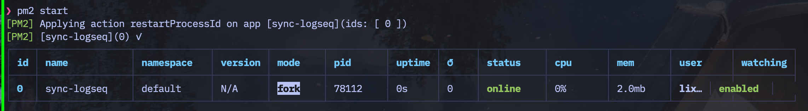

在[之前的方案](https://blog.tomyail.com/how-to-sync-logseq-notes-between-icloud-and-github/)中，logseq 是通过 crontab 进行定期同步，每隔五分钟同步一次。然而，这个时间间隔在某些情况下显得太长。例如，当我在电脑上编辑完成，想要立即在手机上继续编辑时，我会发现文件尚未同步完成，需要等待到电脑的五分钟定时同步时间到达后才能获取到最新的文件。因此，我决定改进这个方案，直接监听 logseq 文件夹的变化，当检测到文件变化后立即执行 git 同步。

我最初考虑使用 chokidar-cli 作为监听文件并执行命令的工具，但是这个工具需要在用户登录后自动执行，并且必须保持在线，若出现错误也需要能自动重启。考虑到这些需求，我转而选择了 pm2 来实现。虽然 pm2 的典型用法是保持服务在线，但我发现它的配置也支持监听文件变化并执行一次性脚本。

这个方案依赖于 nodejs 执行环境，因此你的电脑上必须已经安装了 npm。然后，你需要全局安装 pm2：

```bash
npm i -g pm2
```

安装完成后，在你打算执行 pm2 的地方创建一个名为 `ecosystem.config.js` 的文件，并填入以下内容：

```javascript
module.exports = {
  apps: [
    {
      name: "sync-logseq", // 应用的名称，用于 PM2 的命令行界面和日志文件，随便起
      interpreter: "bash", // 用什么解释器去执行 script 里面的内容，这里用 bash
      autorestart: false, // 我们的 git-sync 每次只需要运行一次，所以当脚本结束时，不需要自动重启
      watch: ["assets", "pages", "logseq", "journals", "draws"], // 需要监视的文件或目录的列表，这些文件夹下面的任何文件变化，都会触发一次 git-sync
      cwd: "/{path of your logseq dir}/", // 脚本执行的当前工作目录，改成你 logseq 的根目录
      script: "/{path of git-sync command}", // 要执行的脚本的路径，从这里下载 https://github.com/kubernetes/git-sync 后改成你自己本地目录
      watch_delay: 60000, // 监视到文件变化后，延迟多久执行 git-sync，单位为毫秒。这里设置为 60000，即 60 秒，也就是说，如果 60 秒内，有多个文件变化，只会触发一次 git-sync
    },
  ],
};
```

接下来，启动 pm2：

```bash
pm2 start
```

不出意外的话结果是这样就表示成功了


其他有用的命令包括 `pm2 status` 查看任务状态，以及 `pm2 log` 查看正在运行任务的日志。

最后，为 pm2 添加开机启动：

```bash
pm2 startup
```

> 执行此命令后，pm2 会给你一个脚本。你需要运行这个脚本以添加系统服务。

让 pm2 开机后自动执行 logseq 同步任务：

```bash
pm2 save
```

这样，你的电脑上的 logseq 文件应该就能更稳定地同步到 GitHub 了。

需要注意的是，之前的定时同步方案仍然需要保留，因为这个新方案的前提是本地文件发生了变动。如果本地文件长时间未编辑，那么就无法获取到最新的文件。
