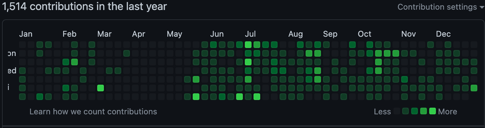

## 读过的书

*   《卡片笔记写做法》
*   《Practical Sql》
*   《Phoenix in action》
*   《脑与意识》
*   《福格行为模型》
*   《如何成为不完美主义者》
*   《欧洲之门》

严格意义上，只有前三本读完了。第一本给了我很多记笔记的新思路，所以一口气读完了。后面两本是都是在电脑上边看边敲代码速度看完的，现在回头看似乎还是没熟练掌握。

在后面的那几本书，基本都是在微信读书上看的，后来发现微信读书读到一半都要收费了，就全部没有继续读了..不过下半年发现了 telegram 上面的 1library 机器人可以免费下载书...所以...

## 看过的电影

*   独行月球
*   航海王：红发歌姬
*   阿凡达 2

这几部电影，给我印象深刻的倒不是内容，而是看电影的时间点，独行月球是在上海解封不久后看的；后面两部是在全国取消动态清零后看的；今年确实什么都和疫情有关。

## 玩过的游戏

*   手机上，基本只有一个炉石传说。暴雪作死，玩了 7,8 年的炉石明年估计玩不到了。

*   steam 平台还是策略游戏为主
    

    *   异星工厂，今年新入坑的神作，时间杀手。从一片荒芜到最终发射火箭，核心是用自动化的手段将制造火箭需要用到的材料全部制造出来，需要考虑各种原材料的供需平衡。玩完这游戏忽然发现对整个社会的经济运作原理都有一定的了解了呢。很适合程序员玩。
    *   地平线，无脑飙车看看风景，画面党表示可以入。

*   ps5，万万没想到，老婆会送游戏机给我当生日礼物。港服充了一年二档会员，到目前为止玩了一个月，坐上沙发上玩游戏体验确实比在电脑前好啊。

    

## 数码设备

*   便携显示器，之前嫌家里一个显示器印象开发效率，但是两个显示器又放不下，所以买了一个便携显示器，打算竖着作为副屏。后来买来才发现竖屏分辨率很怪，设置大了字小，设置小了显示不了多少内容。得出结论搞双屏，两个屏幕方向要一致才有好的显示体验啊。

*   ps5，目前蜜月期，体验很不错，不知道过段时间会不会没时间玩游戏积灰。

    

*   小米扫地机器人 2 Pro，替换我八年前购买的科沃斯扫地机器人。之前的科沃斯很原始，没有主动避障功能，在遇到线多的路地方时很大概率会和线绕在一起不能工作。因此只有在家人有人能监督它时才会使用。这次更新后的小米扫地机器人，有了更好的避障能力，能主动绕过复杂的线路或障碍物，使得自己不用过多干预它就能扫地，设置了每天定时扫地，目前使用下来的效果明显，家中的猫毛明显减少，家人受犯鼻炎的概率也有所降低，不过仍有一些角落和隐蔽处无法清理，所以周末还是得用吸尘器把漏过的地方重点清理一次。

    

## 技术上的收获

*   代码和项目

    

    *   今年自己在 github 上面的提交程度比较活跃，绝大多数提交来自两个项目，因为年初给自己定过两个目标

        *   使用 neovim 作为主要的编辑器；[nvim\_config](https://github.com/Tomyail/nvim_conf) 就是目前在使用的 nvim 配置集合了
        *   使用 logseq 作为自己的主要笔记软件。logseq-mobile 是我用来同步不同平台的笔记仓库，具体做法可以 [参考这个](https://blog.tomyail.com/how-to-sync-logseq-notes-between-icloud-and-github/)

*   自己的本职工作是前端，但是今年打算学一些 Devops 相关的概念的。后来发现用 devops 需要一个比较自由的开发环境供自己做各种小实验，然后就接触到了一个新概念 homelab, 简单来说就是在自己家里搭建一台服务器然后跑各种服务。通过实现这个目标，我改装了家里的台式机，在上面装了 [PVE](https://pve.proxmox.com/) 系统，然后运行各种虚拟机或者 LXC 跑各种服务。目前觉得比较好用的服务有：

    *   [tiny tiny RSS](https://tt-rss.org/) : 自建的 rss 服务器，配合 reeder 阅读文档，体验完美。
    *   [bitwarden](https://github.com/dani-garcia/vaultwarden): 密码管理服务，用来代替 1password 。
    *   [tailscale](https://tailscale.com/): 在各种自己信任的设备间访问自建的服务。
    *   [cloudflare tunne](https://www.cloudflare.com/products/tunnel/): 把自己的服务暴露到公网上。
    *   [traefik](https://traefik.io/): 反向代理软件，比 nginx 使用简单。

    总体来说搞 homelab 终于让自己有一个可以瞎折腾的环境跑各种奇怪的服务了，这就是今年最大的技术收获吧。

*   另外今年用两张信用卡薅了 4 台甲骨文免费主机，看油管流量自由了。
