在这篇文章中，我想分享我的一次 Telegram 帐号差点被盗的经历。这次经历让我体验到了一把被社会工程攻击的感觉，非常刺激。希望通过这篇文章，让更多的人了解骗子的行骗手段，以防止自己的帐号被盗

事情是这样的，我 telegram 上有位亲戚长辈，因为她儿子之前在国外留学，所以有个 tg 帐号，然后某一天忽然找我聊天，然后好戏开场了~~

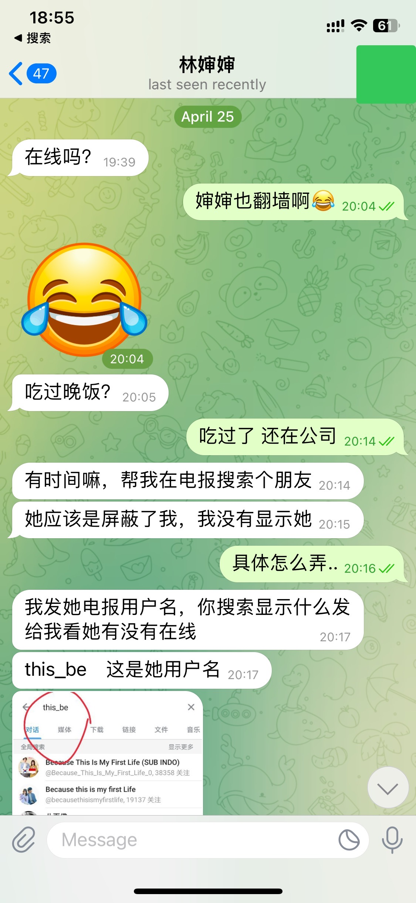

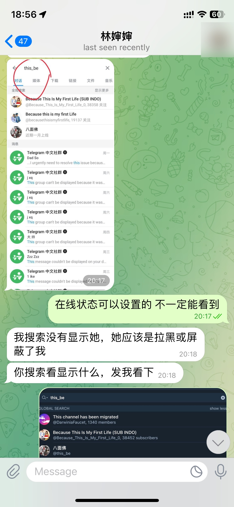

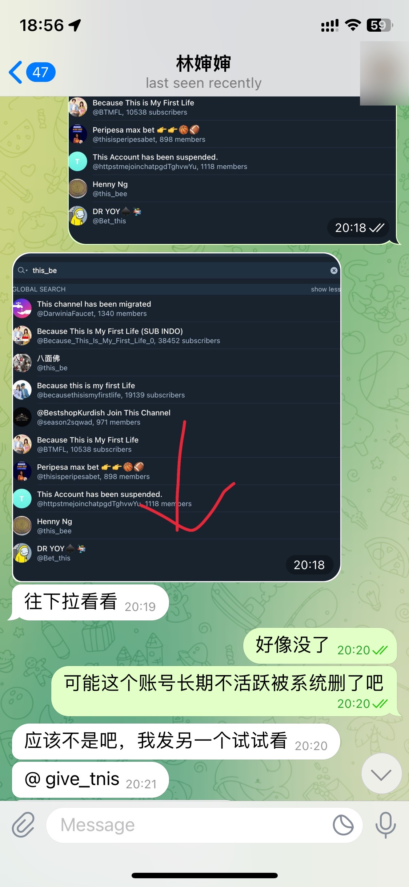

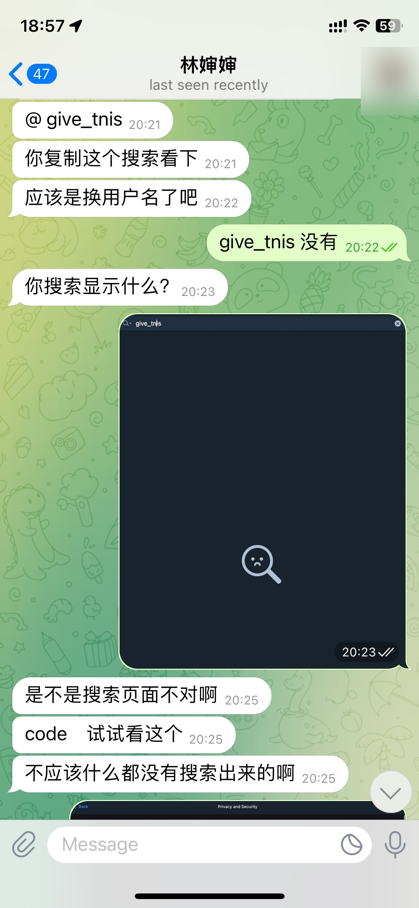

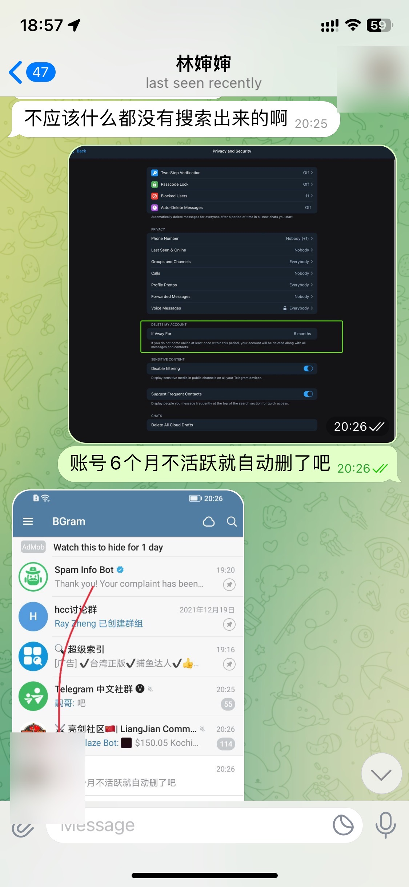

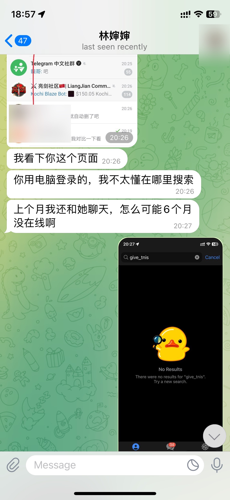

尽管我觉得她在某些方面有些不太了解。但毕竟人家是我的长辈，我还是顺着她的意思一直操作。（但是人家居然能识别电脑端和手机端的区别，我还是很惊讶的）

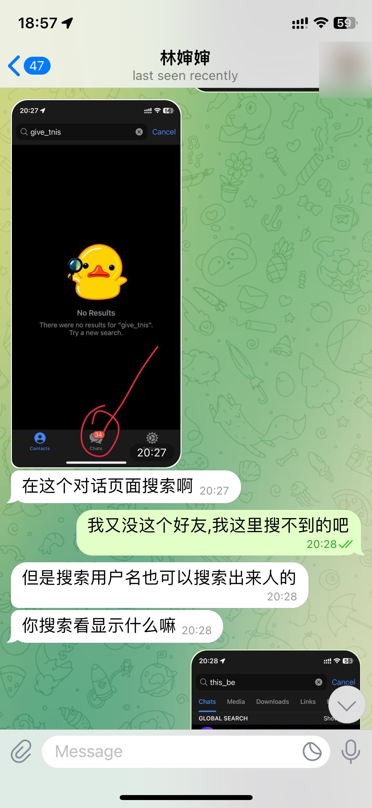

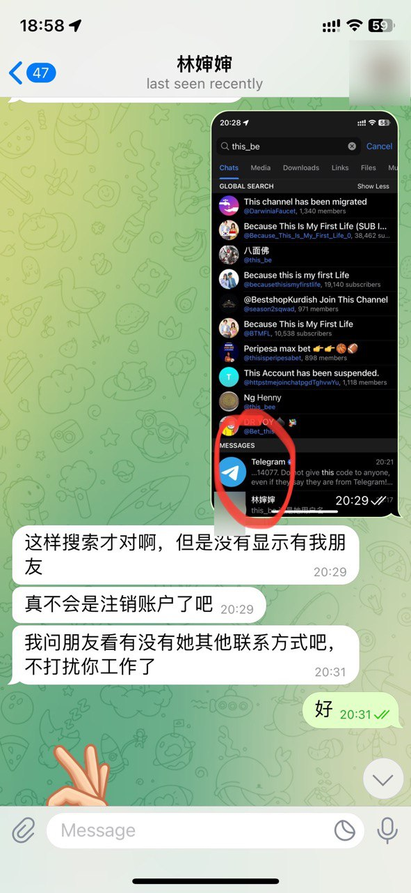

到这里，我注意到她的语气有些不同，不太像我认识的那位亲戚。于是我警觉性提高，结束聊天后，我查看了一下 Telegram，果然发现了异常。

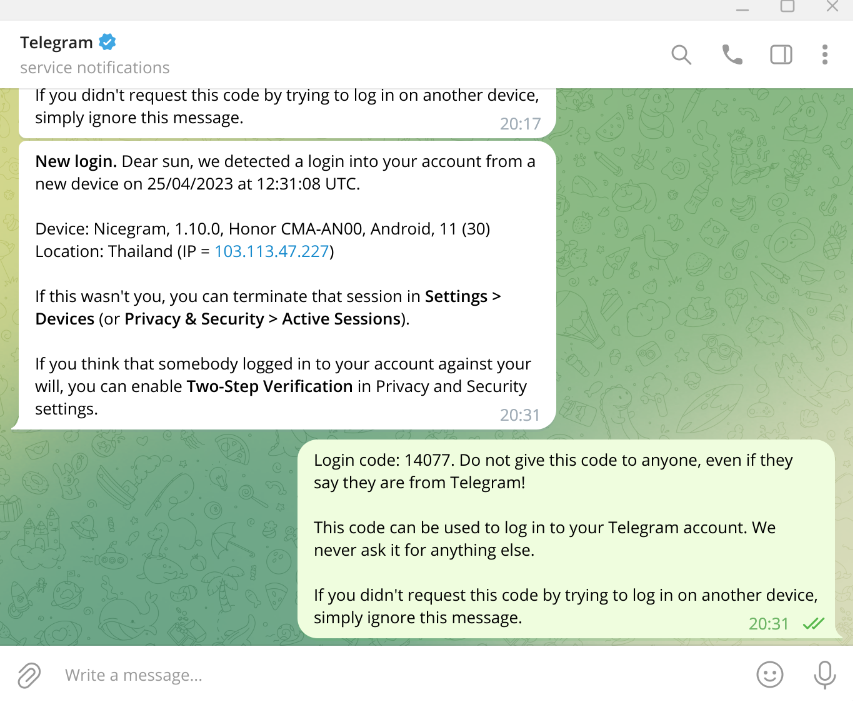

我的帐号显示有一台来自泰国的设备登录，这显然不是我认识的设备。于是我立刻将其从设备列表中移除。事后想想，如果骗子在获得验证码并登录后立刻将我的设备解绑，我可能就发现不了这个问题了。

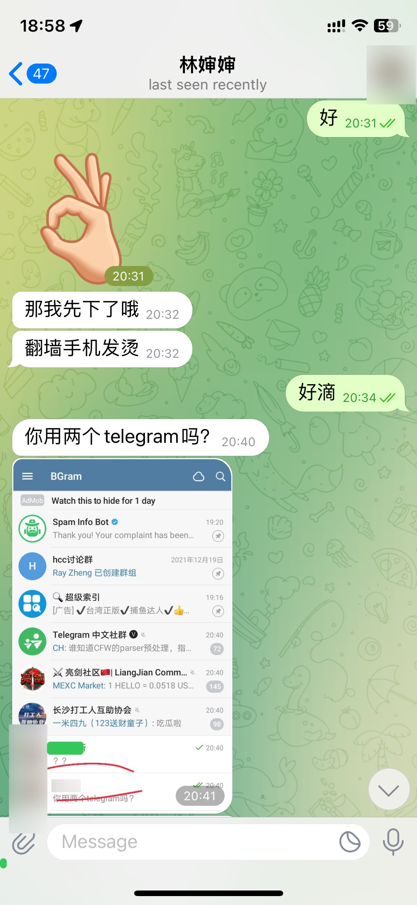

似乎是骗子意识到自己的设备被我移除，又试图继续向我索要验证码重新绑定。但这个时候我已经不再信任对方了。

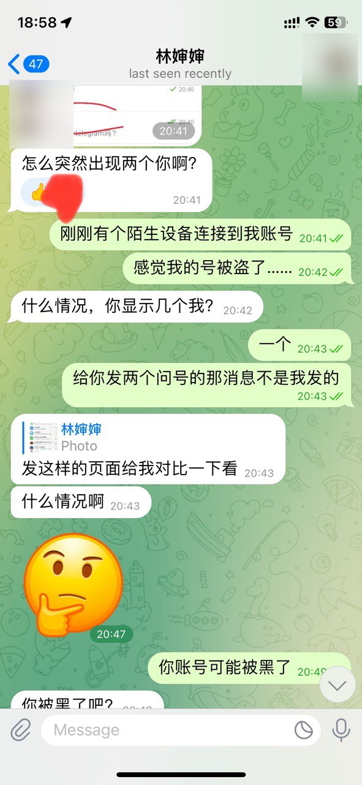

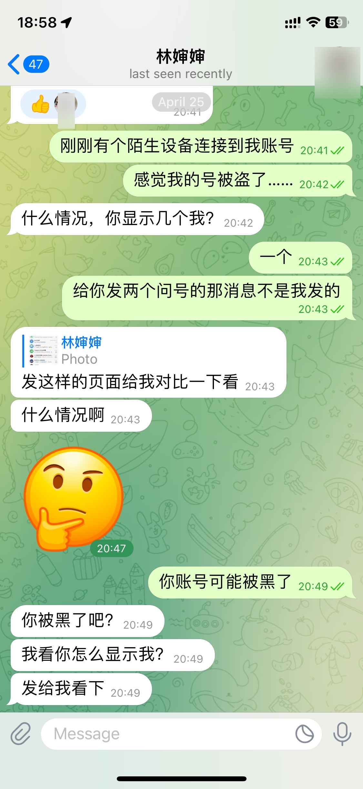

实际上，我当时还不知道对方是如何操作才导致我的帐号面临被盗风险的。于是我在微信上找到当事人进行确认。果然，她告诉我她的帐号被盗了，原因也是因为她截图发送验证码给了对方。

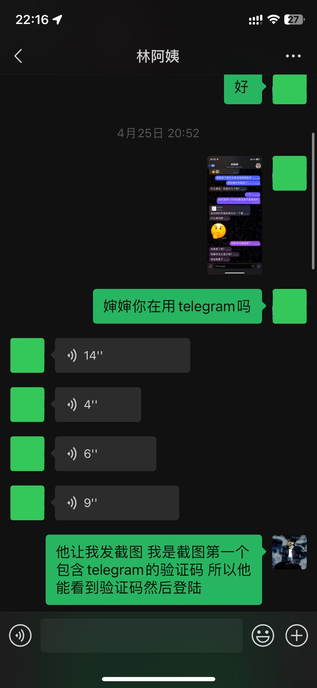

## 教训

*   尽管我们经常被告知不要将验证码泄露给陌生人，但这次因为对方是熟人，我放松了警惕。我没有料到对方会采用如此隐蔽的手段获取我的验证码。
*   升级到最新版本的Telegram，当涉及到验证码的截图时，软件会自动为验证码打码，这在一定程度上可以防止验证码泄露。
*   如果你的账号是通过手机号注册的，建议尽量对所有人隐藏自己的手机号，包括好友。这样可以在好友的账号被盗时，降低自己受到波及的风险。(依次点击Settings -> Privacy and Security -> Phone Number，然后在"Who can see my phone number"选项中选择"Nobody")
*   如果条件允许，开启二次验证也是一个很好的选择，可以进一步提高账号安全性。
