最近一直在学习 [kubernetes](https://kubernetes.io/zh-cn/)（k8s）相关的知识，为了实践学到的知识，选用了 [k3s](https://docs.k3s.io/zh/) 作为实际部署集群的工具，已经为位于美国的四台虚拟机搭建了一个集群，这四台虚拟机中将一台 2 核 3G 的作为 server，满足了 k3s 的最低硬件要求，目前工作良好。


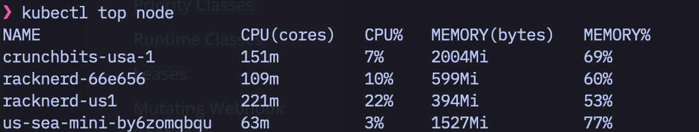


有了这次成功经验之后，想将位于日本和韩国的甲骨文虚拟机也组成一个集群。 这样子就能更加方便的部署应用，而不用每次手动记住自己的应用部署用 docker compose 在哪一台机器上运行着。经过几天的折腾，发现这几台免费送的虚拟机，不能作为 k3s server 来稳定运行，只要一运行 server，就连 `journalctl -f` 看日志都卡。通过 grafana 监控收集的数据分析后发现运行 server 后，io 读写就暴涨，怀疑是硬盘太差引起的。


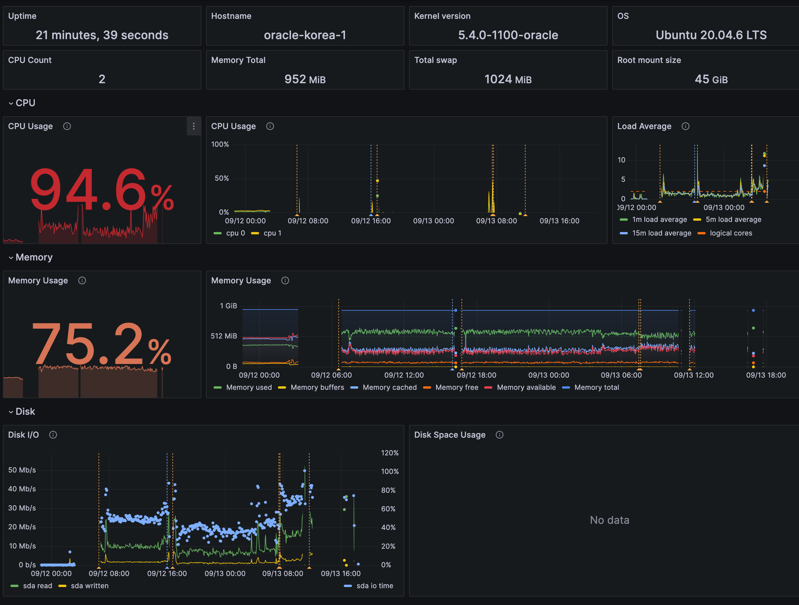


尝试调整 `vm.swappiness=10` 降低将内存数据写入硬盘的倾向，过段时间 swap 直接满了，最后尝试彻底关闭 swap，依然没有明显的改善，在本机命令行执行 `kubectl get node` 都是半天才响应。


而作为对比，隔壁另一台相同配置的虚拟机，闲置的时候资源基本没什么波动，颇有一种打工人在摸鱼的感觉。


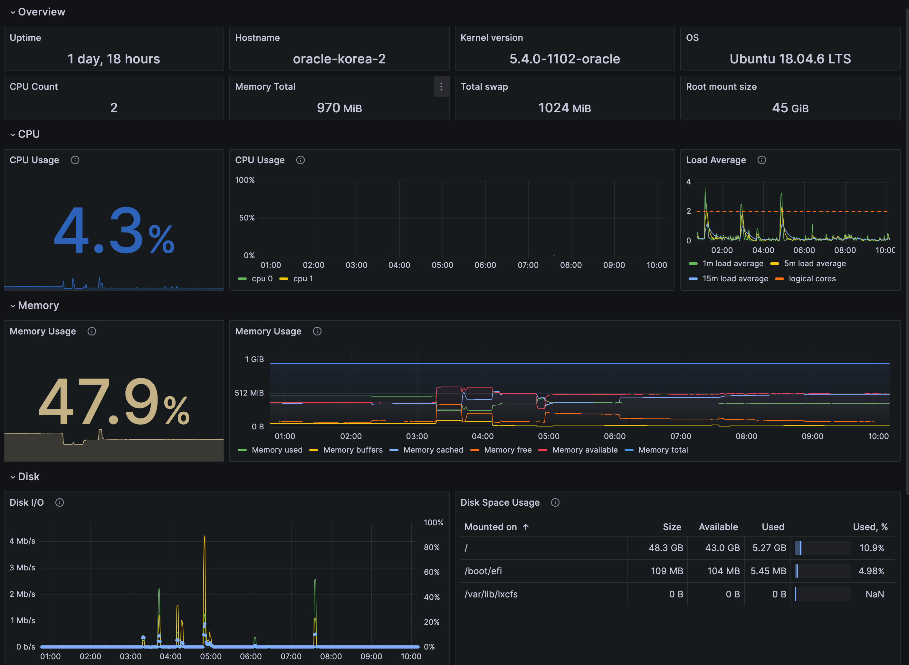


看来直接在甲骨文虚拟机上面建立带 server 的集群有点难为 1 核 1G 的性能，毕竟是免费送的服务器。


由于手上没有其他更高配置的虚拟机，灵光一闪，决定直接在家里 pve 里面搞一台虚拟机作为 k3s server，然后通过 tailscale 来连通所有的甲骨文机器。需要使用 tailscale 主要有两个原因：


1.  家里没有公网 IP，所以甲骨文的虚拟机无法直接和它通信，所以借助万能的 tailscale 来组网，实现一个 k3s over tailscale 的效果。
2.  甲骨文给的虚拟机，虽然有公网 ip，外部访问虚拟机 ip 能正确的获得响应，但这个公网 IP 不是直接给虚拟机的，所以虚拟机查看网卡的 ip 得到的是局域网的 ip，所以对于虚拟机来说，它也算没有公网。


tailscale 作为内网穿透利器，有很多免费的[中继服务器](https://tailscale.com/blog/how-tailscale-works/)。并且 k3s 对 tailscale 的支持也是[开箱即用](https://docs.k3s.io/installation/network-options)的，所以写篇博客记录下整个搭建过程。


## 一：配置家里的 k3 server


server 位于家中，作为集群的控制中心。通过 [pve 的模版](https://tcude.net/creating-a-vm-template-in-proxmox/) 快速创建了一个操作系统，我安装的是 ubuntu 22。


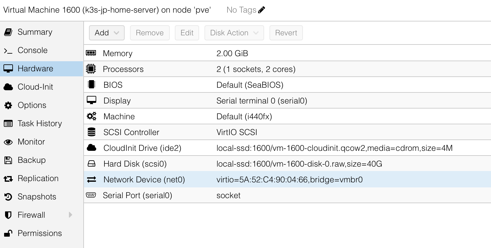


安装完系统之后，ssh 进入创建的虚拟机。然后执行下面的步骤：


1.  [安装 tailscale](https://tailscale.com/download/linux): `curl -fsSL https://tailscale.com/install.sh | sh`


2.  安装 k3s server: `curl -sfL https://get.k3s.io | sh -`


3.  获取 k3s token：`cat /var/lib/rancher/k3s/server/node-token`, 将结果作为 K3S_TOKEN 保存


4.  [创建 tailscale auth token](https://tailscale.com/kb/1085/auth-keys/#generating-a-key)，后面 agent 使用 tailscale 连接需要的授权信息，结果作为 TAILSCALE_TOKEN


6.  [配置 tailscale 的 nameserver](https://tailscale.com/kb/1149/cloud-oracle/#step-4-add-oracle-dns-for-your-tailnet)（这个步骤似乎可以不做）


7.  新增 k3s 配置文件 ` /etc/rancher/k3s/config.yaml` ,里面的内容修改为：


```yaml
vpn-auth: "name=tailscale,joinKey=${TAILSCALE_TOKEN}"
```


你需要将 `${TAILSCALE_TOKEN}` 替换为第四步获得的实际值。


8.  修改完配置文件重启服务 `sudo systemctl restart k3s`


## 二：验证 k3s server 已经通过 tailscale 连接


接着我们需要确保安装的 k3s 服务正确的使用了 tailscale，这样才能让后面连上 tailscale vpn 的机器都能讲它作为 server。


通过 `sudo kubectl get node`


你应该能看到一个 master 节点已经就绪，类似：


    ubuntu@k3s-jp-home-server:~$ sudo kubectl get node
    NAME                     STATUS   ROLES                  AGE    VERSION
    k3s-jp-home-server       Ready    control-plane,master   1m   v1.27.5+k3s1


我这台主机叫 k3s-jp-home-server，它就是当前虚拟机的 hostname


1.  通过 `sudo kubectl describe node k3s-jp-home-server`查看这个节点的细节信息，留意里面的 ip，我这里获取到的 IP 是 100.91.43.90：


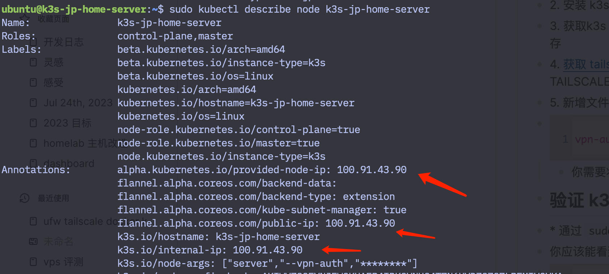


2.  获取当前 tailscale 的节点的 IP：`sudo tailscale status` 找到这台刚刚注册的这台机器的 ip，不出意外的话这个 ip 就是上面截图的 ip。我们将这个 IP 记做 `TAILSCALE_IP`


3.  最后通过 ` curl -vk https://100.91.43.90:6443/cacerts` (替换成你自己的 ip),应该能看到 k3s server 生成的自签名证书。将 `https://100.91.43.90:6443` 作为 `K3S_URL`


到这里我们就拥有了一个在 tailscale vpn 下面可用的 k8s 主节点。


## 三：在甲骨文云配置 k3s agent


1.  进入甲骨文云管理后台，新建一条规则，允许所有协议（相当于关闭了防火墙）


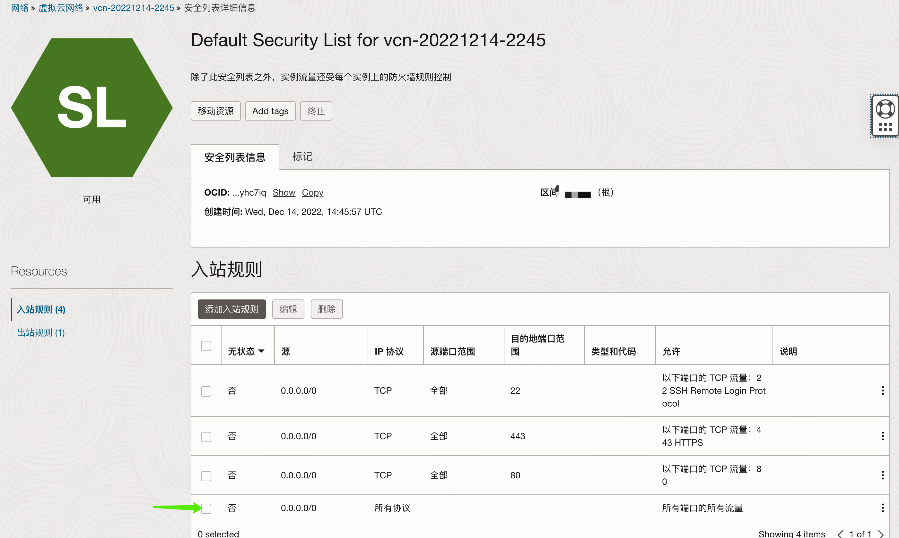


> 开放所有端口并不是一个好的安全实践，更好的方式应该是将 k3s [用到的所有端口](https://docs.k3s.io/installation/requirements?_highlight=port#inbound-rules-for-k3s-server-nodes) 单独加入白名单，不过本着先有再优的原则，我们目前没这么做。


2.  ssh 登陆到虚拟机，删除 ubuntu iptable 加载器，升级 iptable 并重启


> 可选操作，目的是为了最大程度排除 iptable 各种设定可能导致的集群节点相互之间的通信失败，而且 k3s 对 iptable 的版本也有[一定的要求](https://docs.k3s.io/known-issues?_highlight=iptab#iptables)。当然这个设定可能会降低系统的安全性，如果你是安全专家或者 iptables 大佬，可自行决定是否

    apt-get remove iptables-persistant


3.  [安装 tailscale](https://tailscale.com/download/linux): `curl -fsSL https://tailscale.com/install.sh | sh`


4.  运行 tailscale：`tailscale up` 这样才能连接到 家里的 server


5.  通过 `tailscale status` 确认状态正常，然后通过 curl 确认甲骨文能通过 tailscale 连接到家里的 server:


      curl -vk https://100.91.43.90:6443/cacerts


能看到自签名证书后，说明甲骨文能连接到家里的 server 了。


6.  安装 k3s agent：

```bash
export K3S_URL=https://100.91.43.90:6443
export K3S_TOKEN=Kxxx::server:xxx
curl -sfL https://get.k3s.io | K3S_URL=${K3S_URL} K3S_TOKEN=${K3S_TOKEN} sh -
```


7.  配置 k3s 使用 tailscale。和配置 server 一样，新增文件`/etc/rancher/k3s/config.yaml`,里面的内容修改为`vpn-auth: "name=tailscale,joinKey=${TAILSCALE_TOKEN}"`


8.  重启 k3s agent 使得刚刚的配置生效：`sudo systemctl restart k3s-agent`


## 四：验证 k3s agent 成功加入集群


回到家里的终端在通过 `sudo kubectl get node` 应该能看到刚刚加入的机器。

    ❯ kubectl get node
    NAME                     STATUS   ROLES                  AGE     VERSION
    k3s-jp-home-server       Ready    control-plane,master   30m   v1.27.5+k3s1
    instance-20220922-2113   Ready    <none>                 3m    v1.27.5+k3s1

我这里多出来了一台 instance-20220922-2113

同时通过 `sudo kubectl describe node instance-20220922-2113 ` 查看加入的 agent 的 ip，应该是 tailscale 提供的 ip 范围（[100.64.0.0/10](https://tailscale.com/kb/1015/100.x-addresses/)）而不是甲骨文的内网 ip（比如 10.0.0.x）


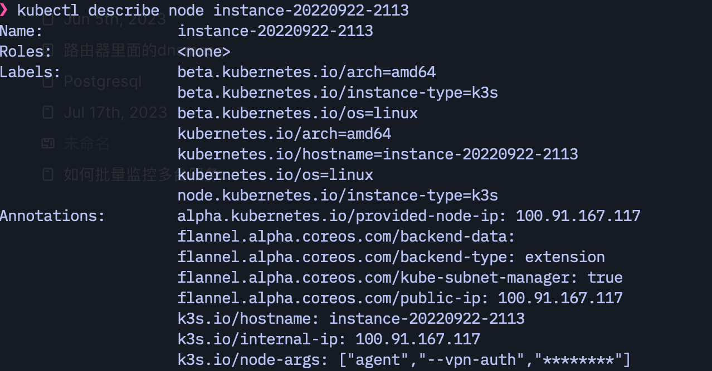


按照上述方法把自己剩下的甲骨文加到这个集群后的效果：


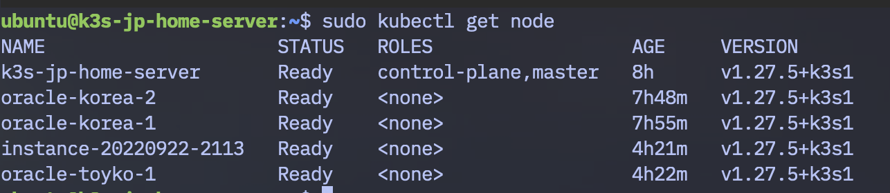


到这里，我们就把所有的免费甲骨文加到集群里面去了。


## 五：验证 k3s 集群功能正常


部署一个最简单的 [whoami](https://github.com/traefik/whoami) 验证一下集群里面各台机器的联通性 (它的原始文件来自 [这里](https://kubernetes.io/zh-cn/docs/tasks/run-application/run-stateless-application-deployment/)，镜像从 nginx 换成了 whoami，方便查看 pod 信息）


新建一个 `traefik.yaml` 文件，内容如下：


```yaml
apiVersion: apps/v1
kind: Deployment
metadata:
  name: nginx-deployment
spec:
  selector:
    matchLabels:
      app: nginx
  replicas: 5
  template:
    metadata:
      labels:
        app: nginx
    spec:
      containers:
        - name: nginx
          image: traefik/whoami
          ports:
            - containerPort: 80

---
apiVersion: v1
kind: Service
metadata:
  name: nginx-service
spec:
  selector:
    app: nginx
  ports:
    - protocol: TCP
      port: 80
      targetPort: 80
      nodePort: 30080
  type: NodePort

---
apiVersion: networking.k8s.io/v1
kind: Ingress
metadata:
  name: nginx-ingress
spec:
  rules:
    - host: nginx.tomyail.com
      http:
        paths:
          - path: /
            pathType: Prefix
            backend:
              service:
                name: nginx-service
                port:
                  number: 80
```


这个配置大致的意思就是新建五个 pod，然后用名字是 nginx-service 的服务 连接这五个 pod，对外暴露一个 ip，最后通过 ingress 将 http 流量路由到这个 nginx-service 服务。新建五个是因为我有五个 node，所以他们大概率会分散到每台机器上。（k8s 如何将 pod 分配到 node 的策略有一堆配置可以学习呢）


之后 `sudo kubectl apply -f traefik.yaml` 执行部署。稍等片刻查看部署状态：`sudo kubectl get pod -o wide`


    ubuntu@k3s-jp-home-server:~$ sudo kubectl get pod -o wide
    NAME                                READY   STATUS    RESTARTS      AGE   IP           NODE                     NOMINATED NODE   READINESS GATES
    nginx-deployment-58ffdc8f48-qzwrb   1/1     Running   0             26h   10.42.2.7    oracle-korea-2           <none>           <none>
    nginx-deployment-58ffdc8f48-7r4bt   1/1     Running   0             26h   10.42.1.6    oracle-korea-1           <none>           <none>
    nginx-deployment-58ffdc8f48-525k6   1/1     Running   0             26h   10.42.0.12   k3s-jp-home-server       <none>           <none>
    nginx-deployment-58ffdc8f48-cgzlf   1/1     Running   0             23h   10.42.3.3    oracle-toyko-1           <none>           <none>
    nginx-deployment-58ffdc8f48-blmh6   1/1     Running   3 (22h ago)   23h   10.42.4.8    instance-20220922-2113   <none>           <none>


在 server 的机器上，curl 上面这几个 ip，看到下面的这些信息就表示集群里面的 whoami 部署成功了


```
ubuntu@k3s-jp-home-server:~$ curl 10.42.3.3
Hostname: nginx-deployment-58ffdc8f48-cgzlf
IP: 127.0.0.1
IP: ::1
IP: 10.42.3.3
IP: fe80::645a:46ff:fe5d:e2f3
RemoteAddr: 10.42.3.1:56192
GET / HTTP/1.1
Host: 10.42.3.3
User-Agent: curl/7.58.0
Accept: */*

```


> 能在 server 上直接 curl 这几个子网 ip，而不用在 pod 内部 curl 的原因是 tailscale 路由了子网，具体可以通过命令` ip route show table all` 确认。里面有类似下面的就是正确的：
>
>     pi@raspberrypi:~ $ ip route show table all
>     10.42.0.0/24 dev tailscale0 table 52
>     10.42.1.0/24 dev tailscale0 table 52
>     10.42.2.0/24 dev tailscale0 table 52
>     10.42.3.0/24 dev tailscale0 table 52
>     10.42.4.0/24 dev tailscale0 table 52
>
> 这里的这几个 10.42.x.0/24, 就是我上面没个 node 的分配的子网


## 六：安装 k8s 图形化管理工具 Lens


始终使用命令行管理集群确实很酷，不过对于刚上手的我来说很多命令还是记不住，所以后面找到了一款管理 k8s 的神器： [Lens](https://k8slens.dev/)。免费版的功能就够用了。我的主要工作环境是 Mac，下载 mac 版之后需要先将 k3s server 的配置文件复制到 mac 上面，具体步骤[官网有](https://docs.k3s.io/zh/cluster-access#accessing-the-cluster-from-outside-with-kubectl)：


> 将 `/etc/rancher/k3s/k3s.yaml` 复制到位于集群外部的主机上的 `~/.kube/config`。然后，将 `server` 字段的值替换为你 K3s Server 的 IP 或名称。现在，你可以使用 `kubectl` 来管理 K3s 集群。


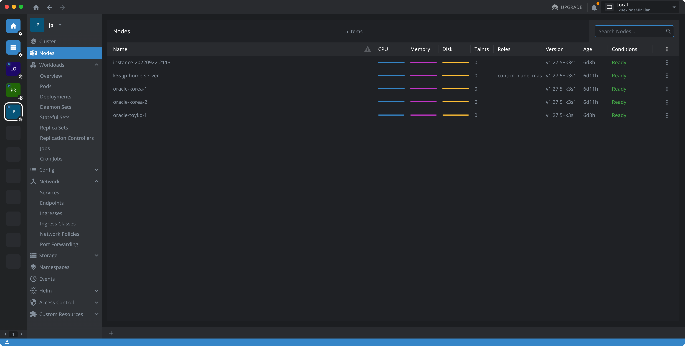


## 七：最终的效果


最后我希望把这个服务发布到外网，然后测试下它的可用性。具体来说就是进入 cloudflare，为刚刚的 nginx 服务增加一条 dns A 记录，这个记录的 IP 可以是任何一个集群里面有公共 ip 的机器。当然你可以选择用一些自动化工具来自动根据 ingress 自动更新 cloudflare dns 记录，比如 [external-dns](https://github.com/kubernetes-sigs/external-dns) 。


最后你就可以通过 [nginx.tomyail.com](http://nginx.tomyail.com) 访问我部署的这个服务了。


简单的跑了一下 [wrk](https://github.com/wg/wrk)，结果如下：


    ❯ wrk -t12 -c400 -d30s http://nginx.tomyail.com/
    Running 30s test @ http://nginx.tomyail.com/
      12 threads and 400 connections
      Thread Stats   Avg      Stdev     Max   +/- Stdev
        Latency   294.73ms   98.54ms   1.54s    78.53%
        Req/Sec    67.81     32.50   212.00     69.38%
      24127 requests in 30.10s, 12.29MB read
      Socket errors: connect 157, read 0, write 0, timeout 0
    Requests/sec:    801.49
    Transfer/sec:    417.97KB


然后 [uptime-kuma](https://github.com/louislam/uptime-kuma) 加了一个 http 监控，从家里检测到的数据：


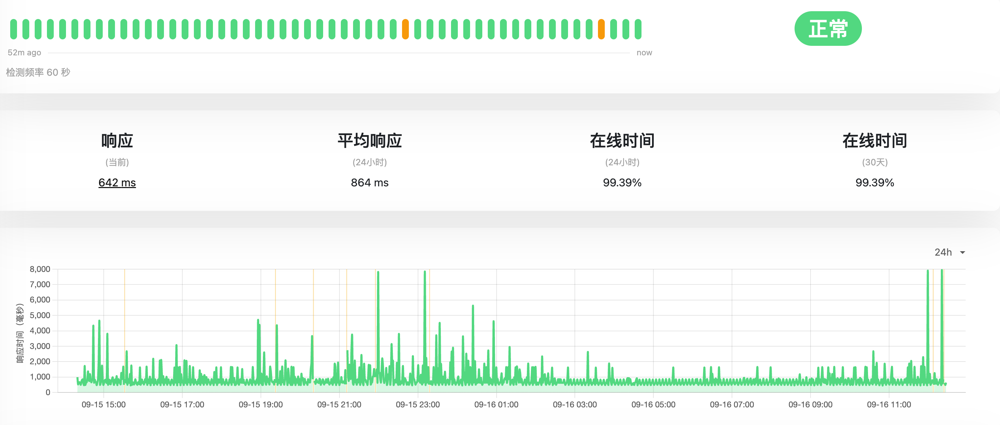


从美国集群的到监控数据


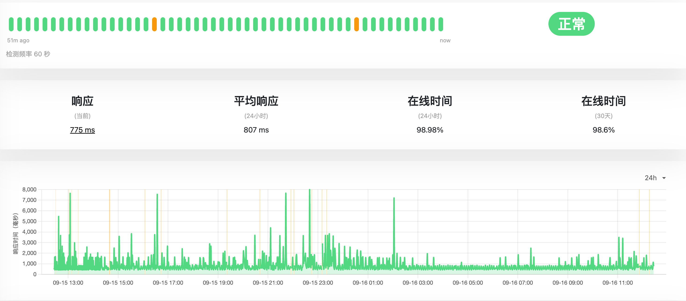


来一个全国测速图


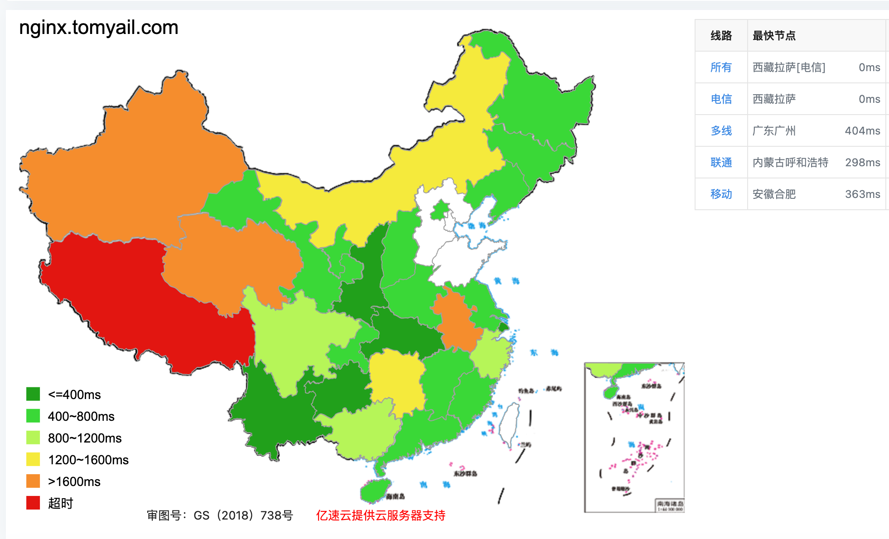


总体来说马马虎虎，不过基本能用，唯一的问题是 http 的延迟不稳定，一会 300ms 以内一会能到 5 秒。


经过一段时间的排查，觉得原因应该出在 traefik 所在节点的位置上。通过下面的命令可以确定 traefik pod 所在的 node，我的就是位于家里。


    ubuntu@k3s-jp-home-server:~$ sudo kubectl get pod --all-namespaces -o wide | grep traefik
    kube-system   helm-install-traefik-crd-689xq           0/1     Completed   0             27h   <none>       k3s-jp-home-server       <none>           <none>
    kube-system   helm-install-traefik-swzks               0/1     Completed   1             27h   <none>       k3s-jp-home-server       <none>           <none>
    kube-system   traefik-64f55bb67d-ct8px                 1/1     Running     0             27h   10.42.0.8    k3s-jp-home-server       <none>           <none>
    kube-system   svclb-traefik-10028888-z7v64             2/2     Running     1 (27h ago)   27h   10.42.0.7    k3s-jp-home-server       <none>           <none>
    kube-system   svclb-traefik-10028888-t8sxz             2/2     Running     0             27h   10.42.1.2    oracle-korea-1           <none>           <none>
    kube-system   svclb-traefik-10028888-nzqlw             2/2     Running     0             27h   10.42.2.2    oracle-korea-2           <none>           <none>
    kube-system   svclb-traefik-10028888-nxtlg             2/2     Running     0             24h   10.42.3.2    oracle-toyko-1           <none>           <none>
    kube-system   svclb-traefik-10028888-7vrbp             2/2     Running     6 (22h ago)   24h   10.42.4.9    instance-20220922-2113


k3s 默认的  [ServiceLB](https://github.com/k3s-io/klipper-lb) (之前叫 Klipper LoadBalancer) 会把每台机器的 流量转发到 拥有 Traefik 的那台机器上，然后 Traefik 再根据路由规则将流量转发到具体的服务上，因为 traefik 默认是安装在 server 上面的，这导致流量的路径是


    cloudflare -> 日本甲骨文的IP -> 流量通过   ServiceLB 转发到 家里的 Traefik -> 在分发到不同的pod上面的nginx 进行响应


简单测试了一下这三个方位的 ping 延迟，这一来一去就无故增加了 200 多 ms，而且家里到国外通过 tailscale 的连接本身也不是特别稳定，这也加剧了网络的波动。


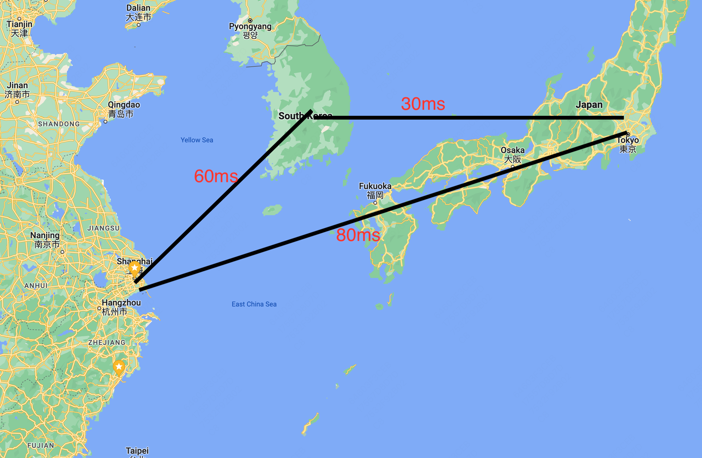


最后的临时解决方案就是位于家里的 server 基本不运行 pod，将 traefik 放到位于日本的服务器上面，这样流量基本就在日本和韩国的这几台服务器之间流转了。


我也在切换后做了一些测试，下面是相关的数据：


首先是 wrk 性能测试：


```
❯ wrk -t12 -c400 -d30s http://nginx.tomyail.com/
Running 30s test @ http://nginx.tomyail.com/
  12 threads and 400 connections
  Thread Stats   Avg      Stdev     Max   +/- Stdev
    Latency   404.05ms  143.99ms   1.42s    75.56%
    Req/Sec    53.38     43.92   272.00     78.45%
  17572 requests in 30.05s, 8.95MB read
  Socket errors: connect 157, read 0, write 0, timeout 0
Requests/sec:    584.76
Transfer/sec:    304.94KB

```


wrk 的数据居然变差了，没想明白原因。


家里 uptime 的数据，可以看到 09-19 之后，延迟的波动瞬间下来了，切换后响应时间基本在 1s 以内。


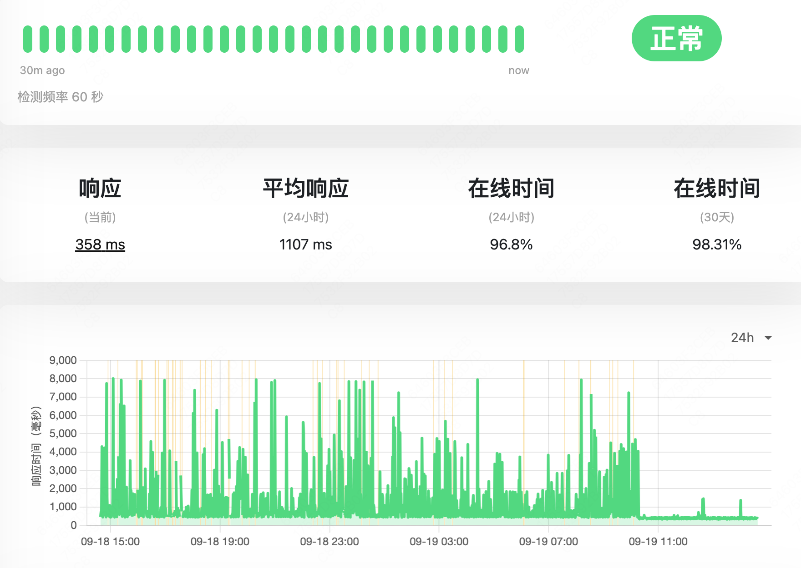


从美国的集群的到的数据和家里一致，请求的延迟波动瞬间稳定了。


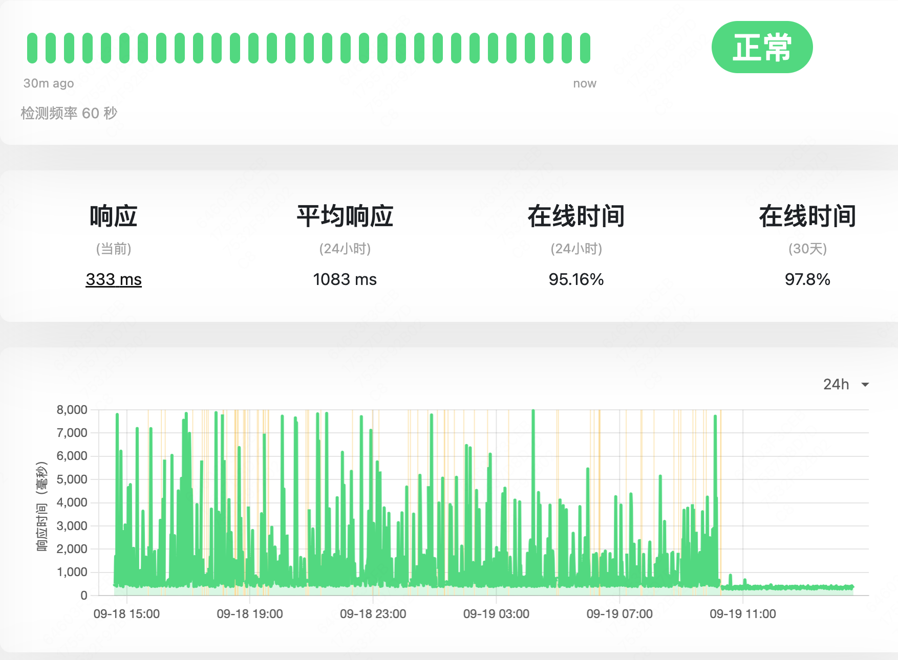


## 总结：


以前，我都是通过 docker compose 单独在每台机器上管理服务的，这次通过迁移到 k3s，部署发布的效率高了好多，也不用特意去记住自己的哪个 docker 服务安装在哪一台服务器上。k3s 大大降低了我入门 k8s 的门槛。而 tailscale 降低了自建 wireguard 的门槛。现在终于可以更加有效率的利用好免费的甲骨文云服务器了。而问题解决的过程，chatgpt 比谷歌能更加直接的给出相关的线索，然后我可以利用它给的线索进一步谷歌验证，这极大的加快了我熟悉陌生领域知识的速度。


## （番外）使用 ansible 批量安装 k3s agent（可选)


重复登录每台服务器执行相同的操作安装 k3s agent 有点烦人，也不便未来维护。可以使用 ansible 定义一个任务，用来安装 k3s-agent. 下面这个任务只包含了安装 k3s agent 的部分，如果想安装 tailscale，可以用这个 [ansible galaxy](https://galaxy.ansible.com/artis3n/tailscale)。


`install-k3s-agent.yaml`文件内容：


```yaml
- name: install k3s agent
  hosts: k3s-agent
  vars:
    K3S_URL: https://chagnetoyourtailscaleserverip:6443
    K3S_TOKEN: changetoyourk3stoken
    TAILSCALE_TOKEN: changetoyourtailscalettoken
  tasks:
    - name: check k3s agent is running
      systemd:
        name: k3s-agent
        state: started
      register: service_status
      ignore_errors: true
      become: true

    - name: install k3s agent
      become: yes
      shell: curl -sfL https://get.k3s.io | K3S_URL="{{K3S_URL}}" K3S_TOKEN="{{K3S_TOKEN}}" sh -
      when: service_status.failed

    - name: ensure config dir exist
      become: true
      file:
        path: "/etc/rancher/k3s"
        state: directory

    - name: copy config to remote
      become: true
      template:
        src: "./k3s/config.yaml.j2"
        dest: "/etc/rancher/k3s/config.yaml"
      notify:
        - restart k3s-agent

  handlers:
    - name: restart k3s-agent
      become: true
      service:
        name: k3s-agent
        state: restarted
```


`host.ini` 文件内容


```ini
[k3s-agent]
oracle-toyko-1 ansible_host=changetovm'spublicip ansible_user=changetoyourvm'suser
oracle-toyko-2 ansible_host=changetovm'spublicip ansible_user=changetoyourvm'suser
oracle-korea-2 ansible_host=changetovm'spublicip ansible_user=changetoyourvm'suser
oracle-korea-1 ansible_host=changetovm'spublicip ansible_user=changetoyourvm'suser
```


`./k3s/config.yaml.j2` 文件内容


```yaml
vpn-auth: "name=tailscale,joinKey={{TAILSCALE_TOKEN}}"
```


最后在命令行执行 `ansible-playbook -i hosts.ini install-k3s-agent.yaml`
