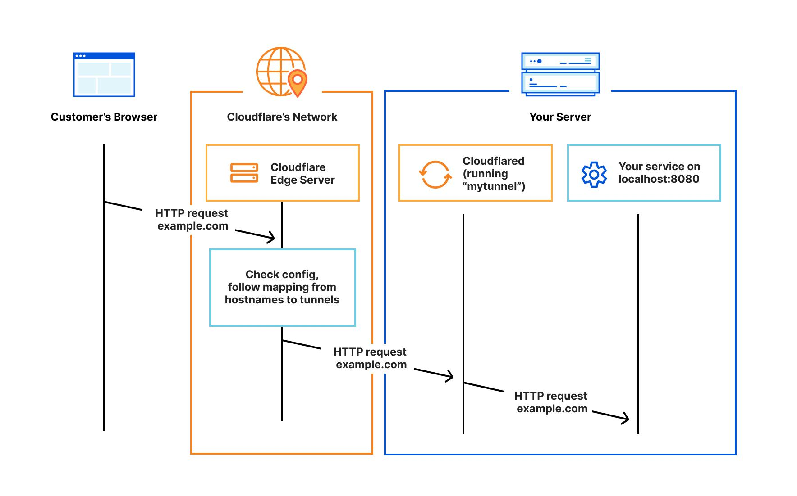
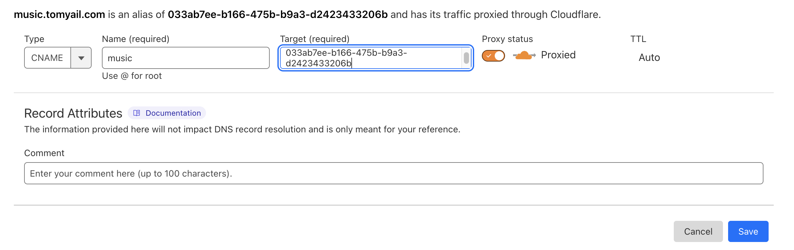
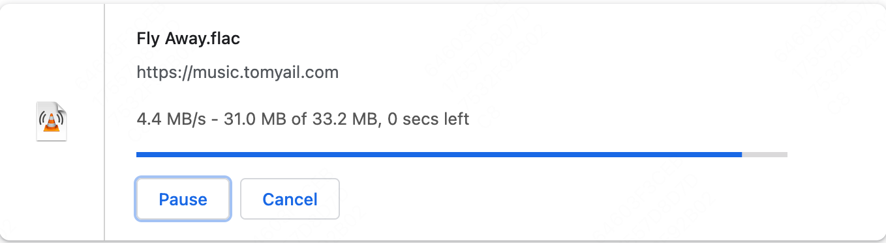

在构建家庭实验室（homelab）时，一个常见的需求是希望能够从互联网访问自家的服务。但现在，许多家庭宽带分配的 IP 实际上是网络运营商的局域网 IP，使得外部网络无法进行访问。在过去，我试过使用花生壳，frp 等工具进行内网穿透，但最后都放弃了。这些工具的缺点在于，要么其免费额度限制过多，要么需要自己额外搭建中转服务。在过去的一年中，我主要使用的解决方案是 Cloudflare Tunnel，它免费、配置简单，而且提供的带宽基本能达到我宽带的最大上行带宽，cloudflare 不愧是业界良心。

本文并非详细介绍 Cloudflare Tunnel 的教程，这样的教程可在[官方文档](https://developers.cloudflare.com/cloudflare-one/connections/connect-networks/)中查询。这篇文章的主要记录我如何使用 Cloudflare Tunnel 访问内网的 k3s 集群服务，因此，你需要拥有一个 k3s 集群，并且对 k8s 相关概念有所了解。如果你需要了解如何构建一个 k3s 集群，可以参阅我之前的文章：[在 Oracle Cloud 和家庭网络之间使用 k3s 和 Tailscale 构建 Kubernetes 集群](https://blog.tomyail.com/using-k3s-and-tailscale-to-build-kubernets-cluster-between-oraclecloud-and-home/)。

在集群里配置 Cloudflare Tunnel 的优点在于它可以直接访问集群内的服务以及局域网内的其他服务。相比于使用 systemd（Linux）或 launchd（Mac）等传统运行系统服务的方式，它提供了更大的灵活性。例如，我可以设置运行 Cloudflare 的副本数量为 2，并分布在两个节点上。这样，即使一个节点出现故障，另一个节点上的 tunnel 仍然可以使用，实现了一定程度的高可用性。

## cloudflare tunnel 的工作原理

1.  为了使用*Cloudflare Tunnel*，你首先需要将提供的外部服务的域名交由*Cloudflare*进行解析。这样，当互联网用户试图访问你的域名时，*DNS*会将流量引导至*Cloudflare*。

2.  接下来，你需要在内部网络中运行一个名为*Cloudflared*的服务，其主要功能是创建并维持一条与*Cloudflare*的通道。这条通道内部设有一套路由规则，确保不同域名的请求可以通过此通道被分流至不同的内部服务。

3.  最后，我们回到第一步，当互联网用户通过*Cloudflare*访问你的域名时，*Cloudflare*的网络就能依照第二步的设定，通过指定的通道请求并获取数据。

以下这张来自[官网的图片](https://developers.cloudflare.com/cloudflare-one/connections/connect-networks/#how-it-works)很好的说明了它的工作原理：



知道了原理再进行实践，很多操作就不会变得过于抽象了。接下来开始具体的操作步骤。

## 注册 cloudflare tunnel

要创建 Cloudflare Tunnel，你需要先[下载 cloudflred](https://developers.cloudflare.com/cloudflare-one/connections/connect-networks/downloads/)。对于 Mac 用户，你可以使用 brew 进行安装：

```bash
brew install cloudflare/cloudflare/cloudflared
```

输入以下命令后会得到一个链接，你只需要在浏览器中打开这个链接，然后登录到 Cloudflare：

```bash
cloudflared tunnel login
```

接下来，你需要告诉 Cloudflare 创建一条新的通道：

```bash
❯ cloudflared tunnel create homelab
Tunnel credentials written to /Users/xxx/.cloudflared/033ab7ee-b166-475b-b9a3-d2423433206b.json. cloudflared chose this file based on where your origin certificate was found. Keep this file secret. To revoke these credentials, delete the tunnel.

Created tunnel test with id 033ab7ee-b166-475b-b9a3-d2423433206b
```

"homelab"是我为通道命名的，你可以根据自己的喜好命名。在同一个局域网环境下，一条通道就足够了，你无需为每个服务创建额外的通道。

同时，Cloudflare 会创建一个 UUID 格式的 json 文件。这个文件名就是通道的 ID，里面包含了该通道的授权信息。

## 在集群内运行 cloudflared

[来源](https://developers.cloudflare.com/cloudflare-one/tutorials/many-cfd-one-tunnel/)

通过注册 Cloudflare Tunnel，我们获取了一条通道的授权信息。现在，我们需要将这个授权信息以 secret 的形式写入 k3s 集群。

具体操作如下：

```bash
kubectl create secret generic tunnel-credentials \
--from-file=credentials.json=/Users/xxx/.cloudflared/033ab7ee-b166-475b-b9a3-d2423433206b.json
```

你需要将 */Users/xxx/.cloudflared/033ab7ee-b166-475b-b9a3-d2423433206b.json* 替换为你在执行 *cloudflared tunnel create* 后生成的路径地址。

接下来，你需要生成一个 Cloudflared 的[配置文件](https://developers.cloudflare.com/cloudflare-one/connections/connect-networks/configure-tunnels/local-management/configuration-file/)。这个配置文件会告诉 Cloudflared 相关的通道授权信息和路由规则。我将其命名为 *00-configmap.yaml*，内容如下：

```yaml
# 00-configmap.yaml
---
# This ConfigMap is just a way to define the cloudflared config.yaml file in k8s.
# It's useful to define it in k8s, rather than as a stand-alone .yaml file, because
# this lets you use various k8s templating solutions (e.g. Helm charts) to
# parameterize your config, instead of just using string literals.
apiVersion: v1
kind: ConfigMap
metadata:
  name: cloudflared
data:
  config.yaml: |
    # Name of the tunnel you want to run
    tunnel: 033ab7ee-b166-475b-b9a3-d2423433206b
    credentials-file: /etc/cloudflared/creds/033ab7ee-b166-475b-b9a3-d2423433206b.json
    # Serves the metrics server under /metrics and the readiness server under /ready
    metrics: 0.0.0.0:2000
    # Autoupdates applied in a k8s pod will be lost when the pod is removed or restarted, so
    # autoupdate doesn't make sense in Kubernetes. However, outside of Kubernetes, we strongly
    # recommend using autoupdate.
    no-autoupdate: true
    # The `ingress` block tells cloudflared which local service to route incoming
    # requests to. For more about ingress rules, see
    # https://developers.cloudflare.com/cloudflare-one/connections/connect-apps/configuration/ingress
    #
    # Remember, these rules route traffic from cloudflared to a local service. To route traffic
    # from the internet to cloudflared, run `cloudflared tunnel route dns <tunnel> <hostname>`.
    # E.g. `cloudflared tunnel route dns example-tunnel tunnel.example.com`.
    ingress:
    # The first rule proxies traffic to the httpbin sample Service defined in app.yaml
    - hostname: uptime-home.tomyail.com
      service: http://uptime-kuma:80
    - hostname: music.tomyail.com
      service: http://music.music
    - hostname: jellyfin.tomyail.com
      service: http://192.168.50.232:8096
    # This rule matches any traffic which didn't match a previous rule, and responds with HTTP 404.
    - service: http_status:404
```

你需要将 _tunnel_ 和 _credentials-file_ 修改为指向你自己的 tunnel id。ingress 的规则是你希望在内网中对外暴露的服务，因此你需要根据实际情况进行调整。由于 Cloudflare 在集群内部运行，它可以访问局域网和集群内的所有服务。

对于局域网的服务，你只需直接指定 _协议://ip:端口_ 的规则，例如，我在这里将 _jellyfin.tomyail.com_ 设置为使用这种方式。对于集群内的服务，你需要按照 _协议://服务名.<命名空间>:端口_ 的格式指定。如果省略了 _命名空间_，那么默认会使用 default namespace，就如同我在这里设置的 _uptime-home.tomyail.com_ 一样。如果忽略了端口，那么默认会使用 80 端口，如我设置的 _music.tomyail.com_ 所示。

接下来，我们需要声明一个 Deployment 以启动 Cloudflared

````yaml title="01-cloudflared.yaml"
---
apiVersion: apps/v1
kind: Deployment
metadata:
  name: cloudflared
spec:
  selector:
    matchLabels:
      app: cloudflared
  replicas: 2 # You could also consider elastic scaling for this deployment
  template:
    metadata:
      labels:
        app: cloudflared
    spec:
      containers:
        - name: cloudflared
          image: cloudflare/cloudflared
          args:
            - tunnel
            - --config
            - /etc/cloudflared/config/config.yaml
            # always using http2 instead of quic because quic is not working in my case
            - --protocol
            - http2
            - run
          livenessProbe:
            httpGet:
              # Cloudflared has a /ready endpoint which returns 200 if and only if
              # it has an active connection to the edge.
              path: /ready
              port: 2000
            failureThreshold: 1
            initialDelaySeconds: 10
            periodSeconds: 30
          volumeMounts:
            - name: config
              mountPath: /etc/cloudflared/config
              readOnly: true
            # Each tunnel has an associated "credentials file" which authorizes machines
            # to run the tunnel. cloudflared will read this file from its local filesystem,
            # and it'll be stored in a k8s secret.
            - name: creds
              mountPath: /etc/cloudflared/creds
              readOnly: true
      volumes:
        - name: creds
          secret:
            # By default, the credentials file will be created under ~/.cloudflared/<tunnel ID>.json
            # when you run `cloudflared tunnel create`. You can move it into a secret by using:
            # ```sh
            # kubectl create secret generic tunnel-credentials \
            # --from-file=credentials.json=/Users/yourusername/.cloudflared/<tunnel ID>.json
            # ```
            secretName: tunnel-credentials
        # Create a config.yaml file from the ConfigMap below.
        - name: config
          configMap:
            name: cloudflared
            items:
              - key: config.yaml
                path: config.yaml
````

最后应用相关的修改：

```bash
kubectl apply -f 00-configmap.yaml -f 01-cloudflared.yaml
```

生效后，你需要登录到Cloudflared后台，为刚刚的主机创建CNAME规则。以music.tomyail.com为例，设置应类似于这样：



注意，target应设置为tunnel的id，同时必须勾选proxy。

至此，如果一切顺利，你的内网服务应该已经可以通过互联网访问了。但请记住，一定要为内网服务设置强密码以防止内网数据被暴露。

## 更新规则

每次新增ingress规则，你都需要修改 _00-configmap.yaml_ 配置文件然后执行

```yaml
kubectl apply -f 00-configmap.yaml
```

Deployment 并不会随着 configmap 自动更新，你需要手动重启相关的 pod 好让 cloudflared 加载最新的配置。

之后进入 cloudflare 新增一条 CNAME。

## 最终效果

直连 cloudflare 没测试过，因为家里所有的设备都会经过主路由，主路由配置了 openclash，而我给 cloudflare 的服务器 `*.v2.argotunnel.com` 都[配置了代理](https://developers.cloudflare.com/cloudflare-one/connections/connect-networks/deploy-tunnels/tunnel-with-firewall/)。代理 vps 是搬瓦工的，速度还行，下载速度如下图：



