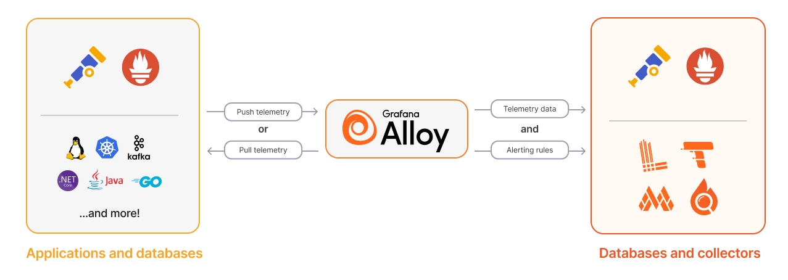

## 背景

在使用 grafana + prometheus + alertmanager 搭建监控系统时，prometheus 是整个系统的核心，它会定期**拉取**监控数据，并将数据存储在自己的数据库中。配合 grafana 可以实现数据的可视化展示。最后通过 alertmanager 配置告警规则，实现告警功能。

但是 prometheus 需要拉取数据源的前提是 promethues 能访问到数据源，但有些情况我们不能或者不希望暴露这个数据源，原因比如：

1. 数据源位于 nat 内网，没有对外 IP
2. 就算有外网 IP，也不希望直接用 ip，而是 http + tls 访问
3. 然后 tls 证书又是自签名的，不被 prometheus 信任
4. 就算有了 tls 证书，也不希望对任何人公开，所以还要加上认证 (basic-auth)

总之，一顿操作下来原本很简单的数据收集变成了麻烦事，promethues 采用拉取数据前提一定是两者都位于相互信任的网络环境。

这个时候让数据源主动推送数据给 prometheus 就是一个比较好的选择。

一开始使用的主动推送的工具是 grafana-agent, 现在更推荐 grafana-alloy，具体原因参考[From Agent to Alloy: Why we transitioned to the Alloy collector and why you should, too](https://grafana.com/blog/2024/04/09/grafana-agent-to-grafana-alloy-opentelemetry-collector-faq/)

grafana-alloy 如何工作呢，简单来说就是在数据源上运行一个服务，它会定期**拉取**数据源的数据 (/metrics),然后将收集的数据再主动**推送**给 prometheus。



## 如何安装

[参考官网](https://grafana.com/docs/alloy/latest/set-up/install/)

- lxc 小鸡鸡就选择 [linux](https://grafana.com/docs/alloy/latest/set-up/install/linux/)
- 内存不要钱的就选择 [docker](https://grafana.com/docs/alloy/latest/set-up/install/docker/) 或者 [k8s](https://grafana.com/docs/alloy/latest/set-up/install/kubernetes/)

## 具体的例子

最近入了 PT 的坑，买了一个盒子刷流，想要监控远程 qbitorrent 的数据，找了个 [prometheus-qbittorrent-exporter](https://github.com/esanchezm/prometheus-qbittorrent-exporter), 然后本地电脑在 docker compose 里面定期拉取 qbitorrent 的数据，然后通过 alloy 推送给 prometheus。

首先你要有一个公网能访问的 prometheus, 不想自己搭建可以试试官方 [grafana cloud](https://grafana.com/products/cloud/),提供的免费额度也够用了。

下面的例子假设使用了官方 grafana cloud, 后面有机会自己搭建了在更新文档把。

首先你需要获得自己 promethues 的地址和 key, 具体就是进入后台，查看 detail,
把下面箭头的三个数据复制下来，key 没有的创建一个。


项目的目录结构：

```
.
├── config
│   └── config.alloy
└── docker-compose.yaml

```


```yaml title="docker-compose.yaml"
version: '3'
services:
  prometheus-qbittorrent-exporter:
    image: ghcr.io/esanchezm/prometheus-qbittorrent-exporter
    environment:
      - QBITTORRENT_HOST=盒子host地址
      - QBITTORRENT_PORT=443
      - QBITTORRENT_USER=qb用户名
      - QBITTORRENT_PASS=qb密码
      - QBITTORRENT_SSL=true
      - QBITTORRENT_URL_BASE=盒子地址后缀(开始不带/)
      - EXPORTER_PORT=10000
    ports:
      - 10000:10000
  alloy:
    image: grafana/alloy:latest
    command: run --server.http.listen-addr=0.0.0.0:12345 --storage.path=/var/lib/alloy/data /etc/alloy/config.alloy
    volumes:
      - ./config/config.alloy:/etc/alloy/config.alloy
    ports:
      - 12345:12345
```


``` text title="config.alloy"
// For a full configuration reference, see https://grafana.com/docs/alloy
logging {
  level = "info"
}

prometheus.exporter.unix "default" {
  include_exporter_metrics = true
  disable_collectors       = ["mdadm"]
}

prometheus.remote_write "grafanacloud" {
  endpoint {
    url = "第一个箭头的数据"

    basic_auth {
      username = "第二个箭头的数据
      password = "第三个箭头的数据
    }
  }
}
  
prometheus.scrape "default" {
  targets = concat(
    prometheus.exporter.unix.default.targets,
    [
    {
      job         = "qbitorrent-exporter",
      __address__ = "prometheus-qbittorrent-exporter:10000",
    },
    ],
  )


  forward_to = [prometheus.remote_write.grafanacloud.receiver]
}
```

`docker compuse up -d` 起来没问题就行了。

最后通过作者提供的[dashboard 配置](https://github.com/esanchezm/prometheus-qbittorrent-exporter/blob/master/grafana/README.md) 就能看到炫酷的下载数据了。


