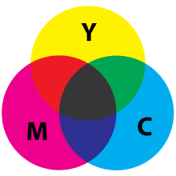
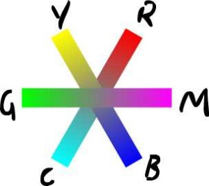

### 为什么印刷中不用三原色(RGB)而用 CMYK?

光波使用加色混合,颜料使用减色混合.

光波三原色的加色混合结果

颜料减色混合的结果

<!--more-->

**颜料的一个特性是反射对应的颜色吸收其他所有颜色**,比如红色颜料反射红色光波但吸收其他光波.

所以如果想看到品红色(0xff00ff),由于品红是三原色红色和蓝色合成的,所以可以用红色颜料和蓝色颜料混合,但是颜色因为有吸收其他颜色的特性,也就说红颜料吸收了蓝色,蓝颜料吸收了红色,这两种颜料相互吸收对方的颜色导致结果反色出来的光不是纯红和存蓝的叠加.所以用红料和蓝料无法得到品红,得到的是紫色(0xA757A8),这就是减色混合.

印刷出来的东西最呈现的颜色还是需要符合三原色合成规律,既然三原色颜料会发生减色混合,那么就是用他们的减色同时反射出三原色中的两种颜色,利用这个原理就能得到印刷的三原色青(0x00ffff),品红(0xff00ff),黄(0xffff00).

**利用印刷三原色的减色混合就能得到光的三原色**了,比如青和品红混合,青色吸收了红色,反射出了绿色和蓝色,品红吸收了绿色,反射出了红色和蓝色(吸收和反射可以通过观察他们的十六进制 rgb,00 位表示吸收了,ff 表示反射).最终他们的结果交集是反射出了蓝色吸收了其他颜色.

### 似乎 cmy 就能形成 rgb 三原色,那么为何要引入 k?

1.  实际印刷时三种颜色的相加只能形成一种深灰色或深褐色
2.  以三层 CMY 叠印产生黑色不仅不容易立即干燥、不利于快速印刷
3.  直接以黑色油墨替代不纯的 CMY 三层叠印产生不纯的黑色，也可以大大节省成本
4.  印刷时用黑色作为标定套版位置的颜色，所以也叫做定位（Key）套版的颜色

### rgb 和 cmyk 的颜色组合

rgb 用十六进制表示,每个色彩通道都有 16\*16=256 中组合,所以总共 256^3.

cmyk 用百分比表示网店面积覆盖率(相当于该颜色的厚度?),每个通道 0-100%共 101 种,所以总共 101^4.

所以后者的颜色组合没有前者多

### grb 和 cmy 的关系

如下图,cmy 能够吸收和它正对的颜色,反射和它相邻的两种颜色.

### 参考资料:

* [印刷四分色模式](http://zh.wikipedia.org/wiki/%E5%8D%B0%E5%88%B7%E5%9B%9B%E5%88%86%E8%89%B2%E6%A8%A1%E5%BC%8F)
* [加色混合](http://zh.wikipedia.org/wiki/%E5%8A%A0%E8%89%B2%E6%B3%95)
* [减](http://zh.wikipedia.org/wiki/%E6%B8%9B%E8%89%B2%E6%B3%95)
* [色混合](http://zh.wikipedia.org/wiki/%E6%B8%9B%E8%89%B2%E6%B3%95)
