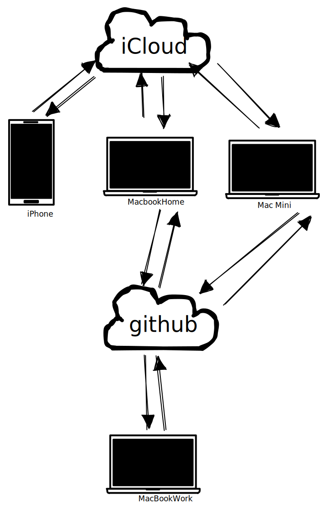

# 遇到的问题

自己使用 Logseq 的平台主要是苹果生态，无奈运行 macOS 的三台机器中(Mac mini，MacBookHome，MacBookWork)，其中 MacBookWork 属于公司的开发机，被禁用了 iCloud。 这导致我无法使用 iCloud 作为统一的同步方案。

比如在使用 iOS 的 Logseq 更新笔记后，无法在 MacBookWork 上面继续编辑，因为移动端 Logseq 同步的笔记上传到了 iCloud，而 MacBookWork 不能连 iCloud。


后来为了同步 MacBookHome 和 MacBookWork 使用了 github。


后来发现这个方案无效，会导致一台电脑上面的 git 记录是好的，iCloud 同步后另一台电脑上面的笔记仓库 git 记录就丢失了。原因是在 Logseq 启动多版本控制后，会在每个笔记根目录生成一个 `.git` 的文件(不是文件夹，应该是使用了[separate-git-dir](https://git-scm.com/docs/git-init#Documentation/git-init.txt---separate-git-dirltgit-dirgt) 参数)，这个文件的内容类似于：

```
gitdir: /Users/xxx/.logseq/git/yyy/.git
```

这里的 xxx 和 yyy 根据每台电脑的用户名和笔记存放路径会不一样。 iCloud 在同步这个文件时， 因为每台机器的用户名(xxx)和存放地址(yyy)不一样，必然导致 `.git` 文件的内容不一样而冲突，冲突后 iCloud 会把冲突的文件重命名成 `.git 2` 之类的带数字后缀的文件，只保存一个`.git` 文件。而这个保留下来的 git 文件只适用一个设备，所以同步后其他设备的 git 记录就挂了。

比较坑的是 iCloud 并没有提供什么选项让我们可以排除某个特定的文件，所以这个`.git` 文件一直会冲突。 一顿搜索下来之后得到的解决方案是这个仓库 [cloud-ignore-files](https://github.com/markogresak/cloud-ignore-files)。 原理是在 iCloud 目录和非 iCloud 建立相同的文件夹，然后利用 [unison](https://www.cis.upenn.edu/~bcpierce/unison/index.html) 工具双向同步里面的内容，同步时忽略 `.git` 文件。这样得到的两个文件夹，iCloud 里面的是不带`.git` 的，另一份是带 `.git` 的。 平时只要在一个目录里面工作，需要同步时调用 unison 即可。

# 总结下怎么做

- 能用 iCloud 的平台,依然使用 iCloud 同步,比如 Logseq 移动端,家里的 macbook
- 不能使用 icloud 的平台,使用 git 同步，比如公司的 macbook
- 利用家里 24 小时开机的 macmini 作为中转站，定期运行 `unision` 在 macmini 上同步了两份 logseq 数据，一份给 iCloud 使用，一份给 github 使用
- iCloud 会自动同步，GitHub 利用 [git-sync](https://github.com/simonthum/git-sync) 自动同步
- 在 MacMini 在定义两个 crontab 任务，用来定期执行 [unison](https://www.cis.upenn.edu/~bcpierce/unison/index.html) 和 [git-sync](https://github.com/simonthum/git-sync)
  

# 如何设置

使用 iCloud 的设备不同设置，主要的设置在作为中转服务器的 Mac mini 上面

## 设置 unison

安装 unison

```bash
 brew install unison
```

测试 unison 同步命令是否正常
我这里需要同步的两个 logseq 文件夹，一个在 home 目录下面(`~/Logseq`),另一个在 iCloud 目录，iCloud 目录比较特殊，路径类似于(`/Users/leosun/Library/Mobile Documents/iCloud~com~logseq~logseq/Documents`) 其中 `leosun` 替换成你们自己的用户名即可
`--ignore="Name {xxx}"` 是 unison 里面忽略同步文件夹的命令行参数，这里定义了需要忽略的文件包括：

- `.git` : 每台设备里面的 .git 路径不一样，忽略
- `logseq/back/*`, `logseq/.recycle/*`： logseq 的备份和回收文件，没什么用
- `logseq/pages-metadata.edn`： 似乎是 logseq 为每个页面设置的 meta 信息，里面的时间戳经常在**重新建立索引后**后全部发生变化，特别容易造成 git 冲突，去掉了也没什么问题。

最终的命令：

```bash
unison -ignore="Name {.git,logseq/bak/*,logseq/.recycle/*,logseq/pages-metadata.edn}" ~/Logseq "/Users/leosun/Library/Mobile Documents/iCloud~com~logseq~logseq/Documents"
```

此时我们在 Macmini 上就得到了两个内容同步的文件夹了。

## 设置 git-sync

我们的 `~/Logseq` 文件夹需要开启版本控制，第一次使用需要初始化 git 仓库，我没有使用`git init` 命令，而是使用 Logseq 桌面版自带的。 具体做法就是用 Logseq 添加图谱，根目录选 `~/Logseq`，然后进入 Logseq 的 `设置-> 多版本控制`，勾选 **开启 Git 自动 commit**
之后把这个 git 版本的 logseq 仓库 push 到 github。
git-sync 没提供 brew 命令，所以只能 git clone 项目到本地了

```bash
  git clone git@github.com:simonthum/git-sync.git
```

假设 git-sync 被保存在 `~/source/personal` 目录下面，我们在进入 `~/Logseq`后执行

```bash
  bash ~/source/personal/git-sync/git-sync
```

第一次在 git 仓库执行命令需要配置仓库，使用以下两条命令：

```bash
  # 具体参考 https://github.com/simonthum/git-sync#options
  # 启动自动同步
  git config --bool branch.$branch_name.sync true
  # 同步的时候自动提交新的文件
  git config --bool branch.$branch_name.syncNewFiles true
```

需要把上面的 $branch_name 换成 `~/Logseq`的分支名， 我这里用 main 作为默认分支。

## 设置定时任务

目前 MacMini 上面的 unison 和 git-sync 是手动执行的，需要改成定期执行，使用自带的 `crontab` 即可：

```bash
  # 编辑 crontab
  crontab -e
```

之后应该会打开编辑器，我的设置是每隔五分钟执行一次，所以命令就是：

```text
  */5 * * * * /usr/local/bin/unison -batch -ignore="Name {.git,logseq/bak/*,logseq/.recycle/*,logseq/pages-metadata.edn}" ~/Logseq "/Users/leosun/Library/Mobile Documents/iCloud~com~logseq~logseq/Documents"
  */6 * * * * cd ~/Logseq && bash ~/source/personal/git-sync/git-sync
```

- 这里使用了 unison 的全路径， 不然 crontab 似乎找不到 unison 在哪里
- 给 unison 加了一个 `-batch` 参数，目的是去掉所有的确认消息
