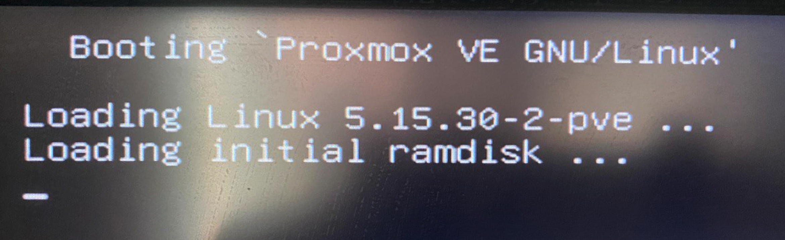
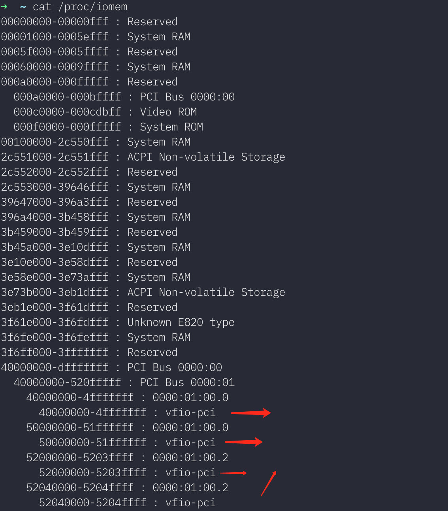

家里的台式机利用率太低,基本只在周末偶尔开个机,想折腾Linux,但又想玩游戏.以前的操作是双系统或者在window下面运行VirtualBox. 最近折腾HomeLab 了解到了一个软件 \**[Proxmox VE\*](https://pve.proxmox.com/wiki/Main_Page)* 可以让你在Linux里面跑window. 所以动了把台式机改造成HomeLab 主力机的想法.

准备工作

1.  首先备份原来Window下面的Steam和Epic 游戏,这里要表扬下Steam,有比较好的游戏备份体验,Epic 完全就是原始的自己复制粘贴.另外备份的之后才知道地平线5, 荒野大嫖客2 怎么这么大,居然每个100多G..

<!---->

2.  买一块大一点的SSD

具体安装步骤:

1： bios 开启

*   前提 cpu 支持，比如我的 [i5-9400f](https://ark.intel.com/content/www/cn/zh/ark/products/190883/intel-core-i59400f-processor-9m-cache-up-to-4-10-ghz.html) ，搜索关键字 VT-d,如果结果是“是“ 就是支持

2: 制作启动盘, 我用的工具是 [ventoy](https://www.ventoy.net/cn/), 然后下载[最新的 pve 镜像(7.2)](https://pve.proxmox.com/wiki/Downloads#Proxmox_Virtual_Environment_7.2_.28ISO_Image.29)复制到U盘. 重启电脑,开机按Del进入Bios设置,修改BIOS的启动项优先级最高是U盘,保存重启.

3:格式化整个ssd(1T),作为pve的系统盘,然后一步步按照界面设置后安装pve.

4: 安装完成后再重启,就进入PVE系统. 我也是装完才意识到,装完pve之后你并不能直接通过外接显示器直接显示pve界面,外接显示器只能看到命令行工具.

*   想看到图形化界面,你需要和pve位于同一个局域网的其他机器,在浏览器输入 https://pve\_ip:8006 访问. 注意必须是https 不是 http. 因为pve系统的https证书是自签名的,没有经过权威机构认证.所以第一次打开浏览器会报安全警告,通过即可. 默认用户名(root)

5: 通过网页进入系统后,开始新建虚拟机

*   上传 window 镜像
*   设置系统信息
*   内存

6: 在网页操作window非常不方便,这个时候需要使用到显卡直通, 以下步骤参照官网的 [文档](https://pve.proxmox.com/wiki/Pci_passthrough):

*   先下载熟悉的命令行工具(可选)
    *       apt-get install zsh git vim
            sh -c "$(curl -fsSL https://raw.github.com/ohmyzsh/ohmyzsh/master/tools/install.sh)"
            git clone https://github.com/zsh-users/zsh-autosuggestions ${ZSH_CUSTOM:-~/.oh-my-zsh/custom}/plugins/zsh-autosuggestions
            # 编辑 .zshrc, plug 新增 z(快速跳转) 和 zsh-autosuggestions(自动补全), 之后 source ~/.zshrc 
*   我是 grub 启动的( 只在用zfs 安装pve 才会用system-boot,否则默认应该都是grub, [出处](https://forum.proxmox.com/threads/how-do-i-know-if-proxmox-is-booting-with-grub-or-systemd-boot.67020/post-300851)), 所以需要修改 grub 配置文件.
    *   `vim /etc/default/grub`
    *   找到 `GRUB_CMDLINE_LINUX_DEFAULT`, 修改为 `GRUB_CMDLINE_LINUX_DEFAULT="quiet intel_iommu=on iommu=pt initcall_blacklist=sysfb_init"`
        *   intel\_iommu=on
        *   iommu=pt 据说能提高性能
        *   initcall\_blacklist=sysfb\_init 后面细说
    *   编辑保存完毕后, 执行 `update-grub` 应用 grub 配置
    *   `reboot` (重启电脑.可选,可以等配置全部做完后做一次)
*   更新 [内核加载项配置文件](https://manpages.ubuntu.com/manpages/trusty/en/man5/modules.5.html) `/etc/modules`
    *       vfio
            vfio_iommu_type1
            vfio_pci
            vfio_virqfd
    *   文档说基于 5.4版本([如何查看内核版本](https://www.cyberciti.biz/faq/find-print-linux-unix-kernel-version/))的内核很多选项已经内置,但为了保险还是显式加上
*   确认自己的系统支持 IOMMU Interrupt Remapping
    *       dmesg | grep 'remapping'
    *   结果包含任何一句即可
        *   "AMD-Vi: Interrupt remapping enabled"
        *   "DMAR-IR: Enabled IRQ remapping in x2apic mode" ('x2apic' can be different on old CPUs, but should still work)
*   屏蔽显卡驱动
    *       echo "blacklist radeon" >> /etc/modprobe.d/blacklist.conf 
            echo "blacklist nouveau" >> /etc/modprobe.d/blacklist.conf 
            echo "blacklist nvidia" >> /etc/modprobe.d/blacklist.conf 
*   找出显卡的pci 地址
    *       lspci -nn | grep VGA
            # 我这里得到的结果
            # 01:00.0 VGA compatible controller [0300]: NVIDIA Corporation TU116 [GeForce GTX 1660 Ti] [10de:2182] (rev a1)
    *   这里的 01:00.0 就是 显卡的地址, 然后找出和显卡在同一个分组的所有设备
    *       lspci -nn -s 01:00
            # 我的结果
            #01:00.0 VGA compatible controller [0300]: NVIDIA Corporation TU116 [GeForce GTX 1660 Ti] [10de:2182] (rev a1)
            #01:00.1 Audio device [0403]: NVIDIA Corporation TU116 High Definition Audio Controller [10de:1aeb] (rev a1)
            #01:00.2 USB controller [0c03]: NVIDIA Corporation TU116 USB 3.1 Host Controller [10de:1aec] (rev a1)
            #01:00.3 Serial bus controller [0c80]: NVIDIA Corporation TU116 USB Type-C UCSI Controller [10de:1aed] (rev a1)
    *   把这四个id写入 `vfio.conf`
    *       echo "options vfio-pci ids=10de:2182,10de:1aeb,10de:1aec,10de:1aed disable_vga=1" > /etc/modprobe.d/vfio.conf
    *   之行 `update-initramfs -u -k all`
    *   然后 `reboot` 重启电脑
    *   重启后的显示器卡在了  这是正常现象
*   重启后执行 `lspci -nnk`
    *        01:00.0 VGA compatible controller [0300]: NVIDIA Corporation TU116 [GeForce GTX 1660 Ti] [10de:2182] (rev a1)
            	Subsystem: ZOTAC International (MCO) Ltd. TU116 [GeForce GTX 1660 Ti] [19da:3539]
            	Kernel driver in use: vfio-pci
            	Kernel modules: nvidiafb, nouveau
            01:00.1 Audio device [0403]: NVIDIA Corporation TU116 High Definition Audio Controller [10de:1aeb] (rev a1)
            	Subsystem: ZOTAC International (MCO) Ltd. TU116 High Definition Audio Controller [19da:3539]
            	Kernel driver in use: vfio-pci
            	Kernel modules: snd_hda_intel
            01:00.2 USB controller [0c03]: NVIDIA Corporation TU116 USB 3.1 Host Controller [10de:1aec] (rev a1)
            	Subsystem: ZOTAC International (MCO) Ltd. TU116 USB 3.1 Host Controller [19da:3539]
            	Kernel driver in use: vfio-pci
            	Kernel modules: xhci_pci
            01:00.3 Serial bus controller [0c80]: NVIDIA Corporation TU116 USB Type-C UCSI Controller [10de:1aed] (rev a1)
            	Subsystem: ZOTAC International (MCO) Ltd. TU116 USB Type-C UCSI Controller [19da:3539]
            	Kernel driver in use: vfio-pci
            	Kernel modules: i2c_nvidia_gpu
    *   这四个设备都变成 `Kernel driver in use: vfio-pci` 代表成功了.
*   之后更新虚拟机的配置,通过web或者命令行都可以,命令行的话文件配置位于 `/etc/pve/qemu-server/100.conf`
*   新增一条 `hostpci0: 01:00,pcie=1,x-vga=1` , 同时把 `vga` 改成 `none`
*   `pm start 100` 启动虚拟机.

怀着激动的心情焦急等待片刻后...

很遗憾我的屏幕短暂切换了一下信号后提示没有信号,然后就一直变黑了.

通过  `tail -f /var/log/syslog` 查看系统日志

在启动过程中,出现了一句

    Oct 16 12:21:33 pve kernel: [ 2839.442981] vfio-pci 0000:01:00.0: BAR 3: can't reserve [mem 0x50000000-0x51ffffff 64bit pref]

*   \#+BEGIN\_QUOTE
    It means that the **vfio-pci** pass-through driver is trying to lock the device (GPU) but is unable to do so, because another process is already accessing the same memory range.
    \#+END\_QUOTE

按照文档的提示在 grub 配置文件加上:

    video=efifb:off

update-grub 并且重启后依然并没有变化...

找了半天资料,最后这 这篇帖子里面找到了答案 https://forum.proxmox.com/threads/problem-with-gpu-passthrough.55918/#post-469188.

这个帖子给了两个解法:

[方法一](https://forum.proxmox.com/threads/problem-with-gpu-passthrough.55918/#post-469188): 通过命令强制卸载显卡占用,然后重新扫描

*       echo 1 > /sys/bus/pci/devices/0000\:01\:00.0/remove
        echo 1 > /sys/bus/pci/rescan

[方法二](https://forum.proxmox.com/threads/problem-with-gpu-passthrough.55918/page-2#post-478351): 就是开头提到的grub 配置文件加上  `initcall_blacklist=sysfb_init`

里面这位大佬的问题[分析过程](https://forum.proxmox.com/threads/problem-with-gpu-passthrough.55918/page-2#post-471013)学到了很多啊 .

首先 通过 `cat  /proc/iomen` 查看内存分配

我这边的结果

*   

这里看到一个叫做 BOOTFB 的程序占用了一段510-512fff 的内存,这段内存空间正好在 上面 `BAR 3: can't reserve [mem 0x50000000-0x51ffffff 64bit pref]` 的  `0x50000000-0x51ffffff` 内存范围内,所以报Bar3错误,可以用这个命令看看内存占用情况?

执行清理操作

*   echo 1 > /sys/bus/pci/devices/0000:01:00.0/remove
    cho 1 > /sys/bus/pci/rescan

清理之后的结果

*   

说明清除了 BOOTFB 对这段内存的占用

最后再启动虚拟机,就能看到期望的结果了

*   

[这个地方](https://www.reddit.com/r/Proxmox/comments/vc9hw3/comment/ice7iwr/?utm_source=share\&utm_medium=web2x\&context=3)解释了这个问题只在特定的pve版本会出现

另外网上很多文章 video=vesafb,efifb:eek:ff 用这种方式写grub参数似乎被废弃了,[最新的方式](https://forum.proxmox.com/threads/problem-with-gpu-passthrough.55918/post-469803)是每个单独分开写.

后面可以折腾 k8s 集群了~~

教程参考:

https://pve.proxmox.com/wiki/Pci\_passthrough

https://www.reddit.com/r/homelab/comments/b5xpua/the\_ultimate\_beginners\_guide\_to\_gpu\_passthrough/ (这篇最详细)

https://www.wangsansan.com/archives/181/

https://wiki.archlinux.org/title/PCI\_passthrough\_via\_OVMF\_(%E7%AE%80%E4%BD%93%E4%B8%AD%E6%96%87)
