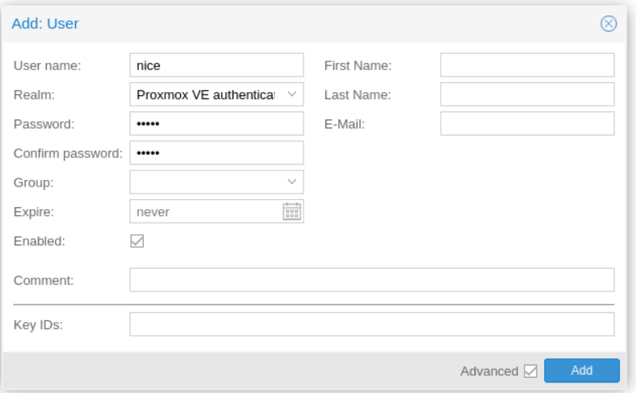
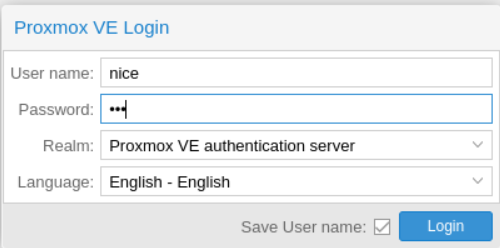
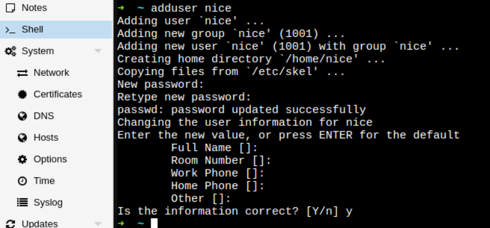
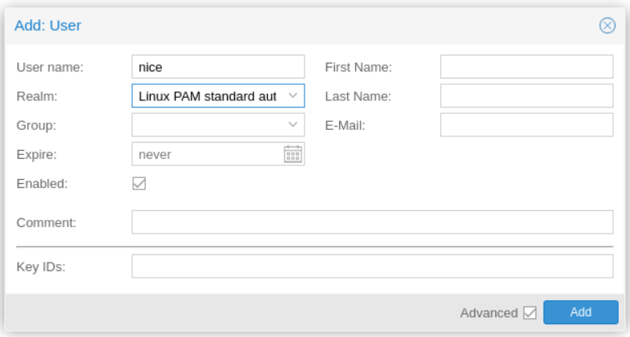
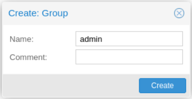
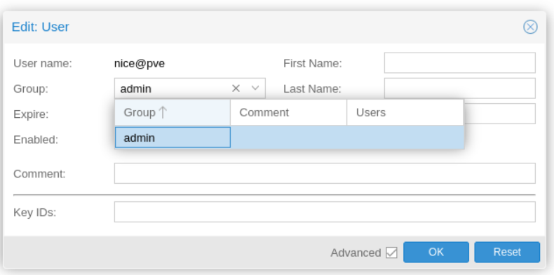
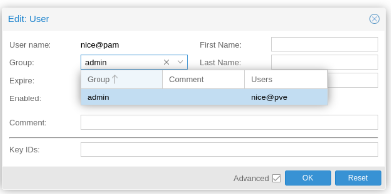
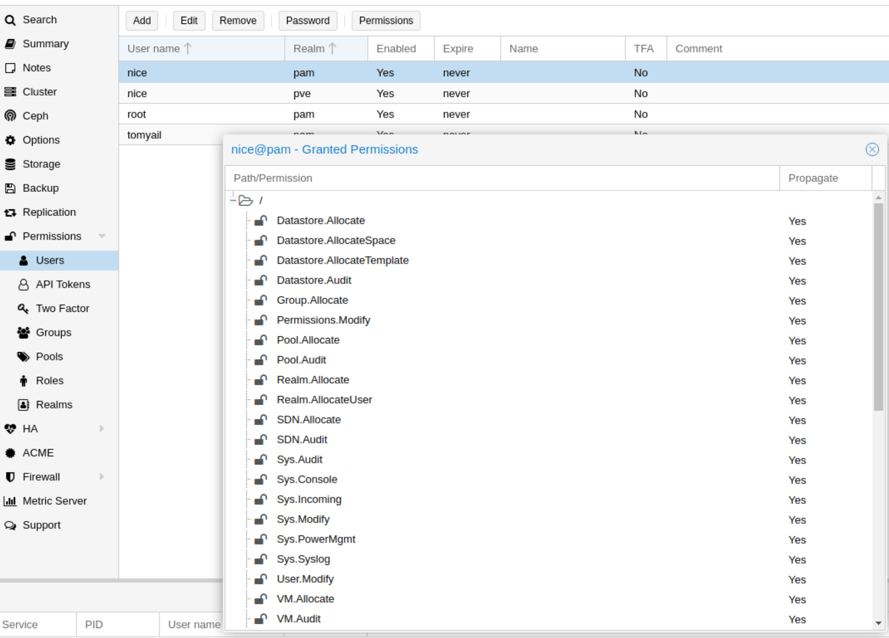
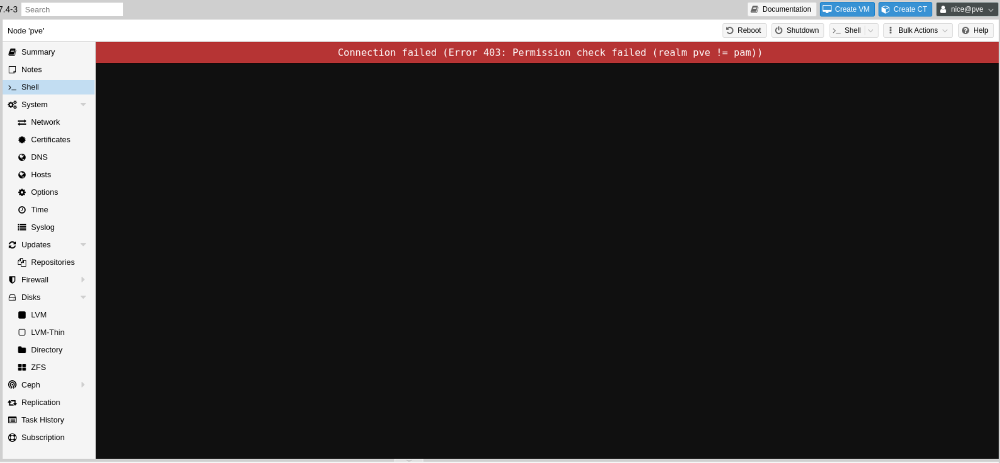

 ## 背景

 在 pve 里面安装 brew for linux 时遇到错误，提示不能用 root 用户安装。因此，打算在 Proxmox VE (PVE) 中添加一个新用户。

 PVE 中存在两种 realm（权限认证相关的）：PAM 和 PVE。这两者的区别如下：

* PAM 类型：适用于需要 SSH 登陆的用户。PAM 用户可以同时操作 SSH 和 Web 页面。
* PVE 类型：仅适用于在 Web 上操作的用户。PVE 用户只能在 Web 页面操作。

## 创建 PVE 用户

 在 Web 界面的 **Datacenter** -> **Permissions** -> **User** -> **add**。 (Floder View)
 输入用户名、密码等信息，然后点击 **Create**。
 请确保正确选择 Realm 为 PVE。

  

  创建完成后，新用户可以登录 PVE 界面。

  

## 创建 PAM 用户

 ### 步骤一：创建 Linux 用户

  1.  用 root 帐号打开命令行。
  2.  输入 `adduser nice`（将 nice 替换为你想要的用户名）并回车。
  3.  根据提示设置用户密码和其他信息。

  参考资料：[Linux 用户管理教程](https://www.runoob.com/linux/linux-user-manage.html)。

  

  为新增的用户授权使用 sudo：`usermod -a -G sudo nice`

 ### 步骤二：在 Web 界面创建 PAM 用户

  1.  在 Web 界面的 **Datacenter** -> **Permissions** -> **Users** -> **add**。
  2.  输入用户名、密码等信息，并将 Realm 更改为 PAM。
  3.  点击 **Create**。

  

  创建完成后，新用户可以登录 PVE 界面。

  默认创建出来的帐号 PVE 权限非常低，基本不能干任何事情，所以接下来就是调整权限的步骤了

 ## 分配权限

  1.  新增用户组：在 **Datacenter** -> **Permissions** -> **Groups** -> **create**，输入用户组名称并点击 **Create**。 (名称随意)

  

  2.  分配角色给用户组：在 **Datacenter** -> **Permissions** -> **Add** -> **Group Permission** 中，Role 选择 **Administrator**, **Group** 选择刚刚创建的 group， **path** `/`表示全部（你可以替换）并点击 **Create**。

  

  3.  将新增的用户添加到用户组：在 **Datacenter** -> **Permissions** 中选择刚刚创建的用户，然后点击 **Edit**，将用户添加到新用户组。

  
  

  4.  查看用户分配的权限：在 **Datacenter** -> **Permissions** 中查看用户分配的权限。

  

  **注意：** 创建出来的 PVE 用户在 Web 界面无法使用 shell，必须使用 PAM 用户。

  

## 总结

本文介绍了如何在 Proxmox VE (PVE) 中添加 PVE 用户和 PAM 用户以及如何分配权限。根据需要选择不同类型的用户，PAM 用户适用于需要 SSH 登陆的场景，而 PVE 用户仅适用于在 Web 上操作的场景。按照本文的步骤，你可以轻松地在 PVE 中管理用户及其权限。(chatgpt 威武~~)

## 后记

如果新增的用户无法使用qm 等 PVE 命令，这是[预期行为](https://forum.proxmox.com/threads/qm-set-command-not-found.45244)，因为他们都在 [sbin 目录](https://askubuntu.com/questions/972611/why-does-sbin-not-included-in-path-for-new-user)底下，想要使用必须加上sudo
另外[补全 pve 命令也有些问题](https://forum.proxmox.com/threads/problem-in-using-sudo-and-bash-compeletion.55915/), 使用 `sudo -E zsh` 可以临时解决（这会保留当前环境变量，使得你可以在新 shell 中使用和修改 root 用户可以访问的文件和目录，同时保留当前用户的环境设置）

## 参考资料
  
1. [Proxmox VE 用户和权限管理 - YouTube 视频教程](https://www.youtube.com/watch?v=frnILOGmATs&t=451s)
